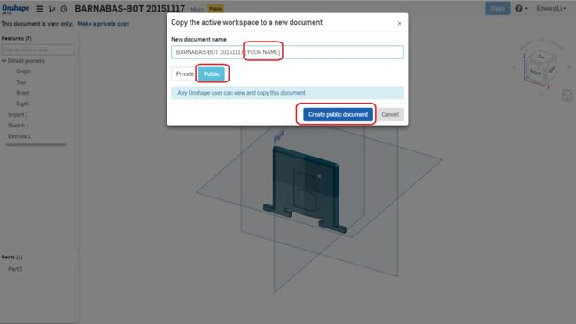
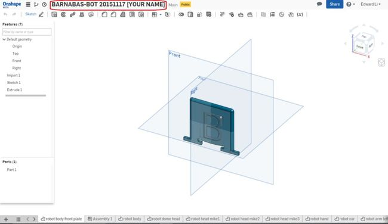
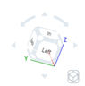
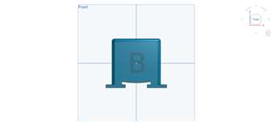
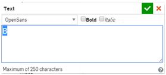

#### Review
   * Review the four parts of a robot and how it relates to the human body
   * What is the difference between design and build?

### Step 1: What Is CAD? (15 minutes) 
Computer-Aided Design (or CAD) is used by engineers across many disciplines.  Specifically, when building a robot, CAD is used by a mechanical engineer to create the frame or body of the robot.  CAD software allows us to create very precise designs with perfect lines and shape, that would be difficult to sketch by hand.  CAD is also advantageous because the blueprint is stored digitally and can be accessed on most devices anywhere in the world at a moment’s notice.  With an electronically-stored blueprint, an engineer can then create the design using a machine and material of their preference.  Our robots will be 3D-printed using plastic.





### Step 2: CAD Walkthrough (45 minutes) 
#### Preemptive Vocabulary
   * **L-CLICK**: Clicking with the left button of your mouse or mouse pad.
   * **R-CLICK**: Clicking with the right button of your mouse or mouse pad.

Onshape is a very convenient CAD tool. It uses your internet browser and saves all your files to a cloud server. Because of this we do not have to worry about installing software or misplacing files. After creating your own Onshape account follow the instructions below:

1. Once you are logged into OnShape, open the Barnabas-Bot Template file.

2. Create a copy by L-CLICKing on "Make a private copy"
{:class="image "}

3.  Name the project: "BARNABAS-BOT 2.3 [YOUR NAME]. Make sure to choose "Public".
{:class="image "}

4. Once you do this, a new project should open up, which will be a copy of the original project, but with this new name.
{:class="image"}

5. You are now ready to customize your robot's body!

#### OnShape Basics
Before diving into things you will need to become somewhat proficient with OnShape’s tools. Here are a few tips on how to move stuff around in OnShape:

1. Open the file "robot body front plate."
2. **Rotation**
  * Method 1: L-CLICK on arrows in the cube on the top left to rotate the entire perspective.{:class="image right"}
  * Method 2: R-CLICK on a part and move the mouse.
  * Method 3: L-CLICK on the "FRONT, BACK, LEFT, ETC." on the cube on the top left.
3. **Translating** a part (moving it up, down and side to side)
  * Method 1: Hold down CTRL and R-CLICK on the part to move it around.
  * Method 2: L-CLICK down using the SCROLL button to move it around.
4. **Zooming**
  * Use the scroll button to zoom in and out.
  * Go to "FRONT VIEW."
  * Press "F" to fit the part into your screen.  This is called, "ZOOM TO FIT."
  {:class="image fit"}

#### Writing on Your Robot's Body
Now we will begin the design of our own custom robot. This starts by customizing the text on the front plate (chest) of your robot. In this section we will learn both how to enlarge and how to change text:

1. Open the "robot body front plate" file in OnShape. 

2. Change the size of the text
  * Double L-CLICK on the “B” until you see a number pop up on the right side of the screen {:class="image fit"}
    * Change the number to a larger number (like 2 or 3). The B should be larger now!
    * Change the value to “0.5”. The B should be smaller now!
    {:class="image left"}
    * Click on the green check mark to save your changes
    {:style="overflow: hidden;"}

3. Move the location of the text.
  * R-CLICK on the “B” and L-CLICK on “Edit Sketch 1…”
  * L-CLICK on one of the 4 blue corners (they are kinda small, you might need to zoom in) of the rectangle around the B and drag the blue rectangle up and down {:class="image "}{:style="overflow: hidden;"}
  * Click on the green check mark to save your change
4. Change the text.
  * R-CLICK on the “B” and L-CLICK on “Edit Sketch 1…”
  * R-CLICK on the “B” again and L-CLICK on “Edit Text”
  {:class="image "}
  {:style="overflow: hidden;"}

  * Now change the text to “C”. Click on the green check mark and see if it changes!
  * Now change the text to “BARNABAS”. You’ll see that it doesn’t fit on the robot face. How can you make it fit? (Change the size of the text to 0.3 or less)
  * Click on the green check mark and see if it changes!

5. Now change the text to whatever you want!
  * It can be a single letter, or many letters. Play with different sizes. Make sure that all of the text fit on the robot! Remember to click on the green check mark to save your changes! Make sure to keep the size of the text larger than 0.3 so that it comes out well during printing!

#### Putting Your Robot Together
This is where you will put all your robot's body parts together and create the final file that you will share with us. You will need to drag and rotate your robot’s pieces into place. Keep in mind that you shouldn’t be concerned with perfection. Regardless of mistakes in the assembly file, the parts will be 3D printed appropriately. Follow along with the steps below to assemble your robot:

{:class="image right"}  **Create an assembly file**
1. L-CLICK on the “+” sign at the bottom left of your screen  
2. L-CLICK on “Create Assembly”  
Your assembly file should automatically open up  
{:style="overflow: hidden;"}

{:class="image right"}  **Insert the body**
1. Insert your body by clicking on the insert button  
2.  Now select the "robot body" file by selecting it in the list of files. Place it in your assembly file and click on the green check mark to save your work!  
* Now go to the Front View  
{:style="overflow: hidden;"}

{:class="image right"} **Insert the front plate**  
Now insert your "robot body front plate" file. Align the front plate with the body by left clicking on it and dragging it. You’ll need to rotate the views to get it to align correctly.  
{:style="overflow: hidden;"}

{:class="image right"} **Insert one head**  
Using the same process as before, insert the head that you want 
{:style="overflow: hidden;"}

{:class="image right"} **Insert your left arm and align it**
{:style="overflow: hidden;"}

{:class="image right"} **Insert your right arm**  
* You'll need to rotate it to align it correctly  
* L-CLICK on the arm to show the rotation tool  
* Click on the circle shown in the picture to rotate   
{:style="overflow: hidden;"}

{:class="image right"} **Line it up**  
* After it is rotated, align it correctly with the hole  
{:style="overflow: hidden;"}

#### Vocabularyte
* **Dimension**: A measurable extent, such as length, depth, or height.
* **Axis**: An imaginary line an object rotates around. Ex. the Earth has an axis that goes through its north and south pole. It rotates around this axis once every day.
* **Plane**: A flat, two dimensional object that extends infinitely far.
* **Rotation**: The movement of an object around its axis or center.
* **Translation**: The movement of an entire object in a direction. The object is not altered or rotated in any way.
* **Isometric**: Of or having equal dimensions. An isometric view, for example, will show all three dimensions equally.



