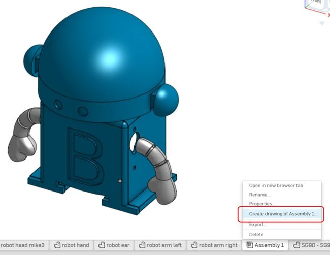
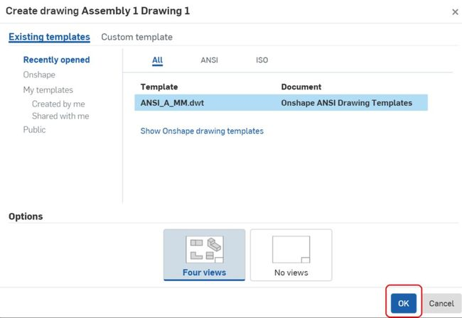
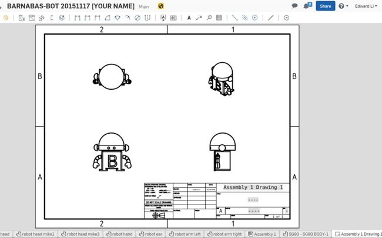
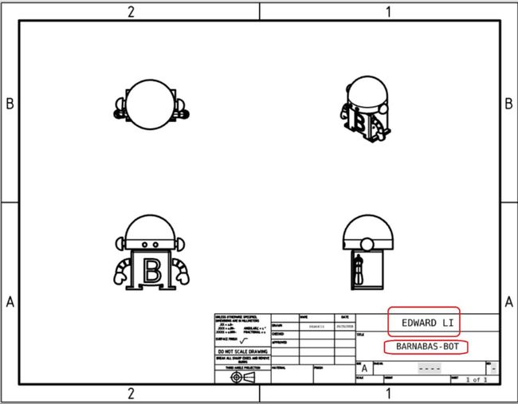

#### Review
* What advantages does CAD give us as opposed to designing by hand?

### Step 1: Creating An Assembly File (10 -15 minutes) 
With the robot assembled we have the opportunity to generate a drawing of the robot. The drawing consists of four 2 dimensional views of the robot, each from a different angle. The overall drawing resembles something closer to a traditional blueprint and will be included with your robot’s 3D printed parts when those are shipped to you.

* R-CLICK on the assembly file tab that you just created
* L-CLICK on "Create drawing of ... "
{:class="image center"}

* A screen will pop up. Make sure that "Four views" is selected under "OPTIONS", and L-CLICK on "OK"
{:class="image center"}

* A drawing will be automatically created.
{:class="image center"}

* Double L-CLICK on the text boxes to edit the text. Write your name as well as your robot's name.
{:class="image center"}

* You are done!

#### Share your robot with us!
This step is necessary if you would like us to 3-D print your robot for you.  

* Directions on how to shares file on OnShape 
* Share it with the following email address: "info@barnabasrobotics.com"

Once you share it with us, we will provide a confirmation within 24 hrs.  Now just sit back and relax as we start putting your robot kit together!


 