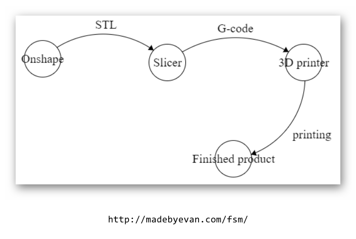

#### Review
* What CAD operations did we learn to do last week?

### Step 1: Introduction To 3-D Printing (25 minutes) 
Over the last two lessons the process of 3-D printing has been mentioned, but I think it is time to explicitly ask: “What is 3-D printing?”. That question is much more complicated than it originally seems. We can begin to answer it by drawing similarities and differences between a 3-D printer and your paper printer at home. The big difference is that a 3-D printer will print layers one on top of another, accumulating height while doing so. Using an analogy we can say that the 3-D printing process is much like writing your name on a cake, the icing sits atop the rest of the cake.

3-D printers are used by engineers in the field to quickly build designs. They are used as rapid prototyping machines more often than not, giving engineers the opportunity to design, build and test an idea in the same day. This means that while 3-D printers are not always creating the finished product, they are still crucial to the design process.

The process of getting a 3-D file to the printer isn’t as simple as you may suspect. It is not as easy as throwing the file we designed into a 3-D printer and turning it on. The CAD file we designed previously can be exported from Onshape as what is called an STL file. STLs are a common format for 3-D files. Unfortunately for us, a 3-D printer does not accept STL files. Instead they are made to accept g-code files. A g-code file is a file made up of many two dimensional drawings which will ultimately be printed one on top of the other to create the finished product. A g-code file tells the 3-D printer the specifics of how it should move and how much plastic to extrude at any one time.

What is needed is some way of converting an STL file to a g-code file. This can be done with a slicer program. A slicer will take the 3-D STL file and slice it into each 2-D piece. The overall process is shown in simplified form below:

{:class="image fit"}

Draw a 3-D printer on the whiteboard, making sure to label important components:

{:class="image fit"}

Going over the significant parts:

#### Vocabulary

* **Filament**: A long string of plastic that is fed into the extruder where it is melted and used to print an object.
* **Extruder**: The component responsible for heating and printing the plastic material of the filament.
* **Cartridge**: Where the filament is held.
* **Platform**: Where the object is printed.

Have the students attempt to point out these parts on the 3-D printer. Perhaps also ask them questions such as: How many motors do you see? What does each motor do?

### Step 2: Industrial Design (20 minutes) 
Industrial design is a term that refers to two different aspects of a manufactured product. The first is the object’s usefulness (function). The second is the object’s beauty (form). When engineers design products for the public they need to carefully consider the role of the product and determine how much of their effort goes into the form of the product and how much goes into the function of the product. Some things do not need to look pretty, they just need to work. Others need to draw people's attention to have a chance in the market.

Lead the students in a discussion about common items (especially electronics) and ask the students if they think that form or function is more important for that item. 





Hand each student the drawing of their robot as well as a box with the robot parts inside. The box should contain everything except the custom 3-D printed parts. You can hand those out next time. The drawing of their robot can be placed inside the box under the top. 
