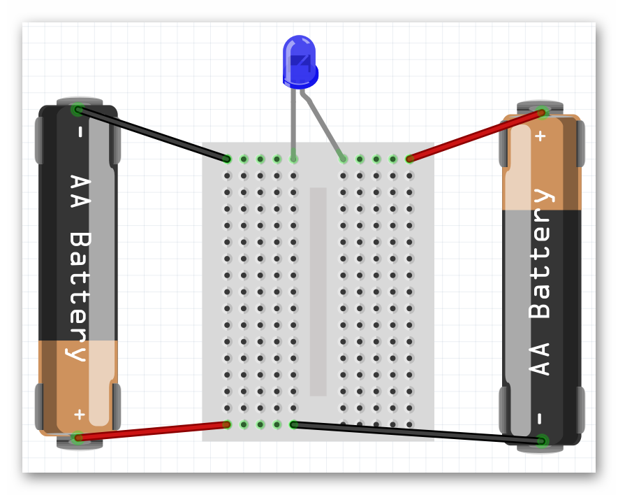

### Review
   * How do open and closed circuits differ?
   * How does increasing voltage affect a circuit?

### Step 1: Introducing The Breadboard (15 minutes) 
In this lesson we are introduced to a very valuable tool, The breadboard. What is a breadboard?

A breadboard helps us connect our wires (analogous to blood vessels) together.  We can connect our wires to the holes in the breadboard to make secure connections without needing to tie the wires together.  This is useful, especially when we need to change the connections often.  This is common while engineers figure out how to best make their ideas happen. Draw a picture of the miniature breadboard on the whiteboard.  NOTE: You can use the 1-17 (rows) and A-J (columns) references to tell kids where to place wires as the lesson progresses.

{:class="image center"}

   * How many rows are there? (17)
   * How many columns are there? (2 sets of 5)

In a breadboard All the holes on each row of 5 are connected to each other. By connected I mean that any two things placed into the same row will be connected to each other. The breadboard helps us make closed circuits. Test the kids to see if they understand which holes connect to one another.

#### Vocabulary
   * **Breadboard**: A tool used to create circuits. The breadboard is able to connect two or more components together as if their were touching so long as they are on the same row.
   * **Component**: A single element of a circuit. Ex: battery, LED.



### Step 2: Creating Our First Breadboard Circuit (15 minutes) 
Now that we understand how to use the breadboard we can recreate the 3V LED circuit from the last lesson. This time as a completely hands free circuit. Let’s start by recalling the schematic for that circuit.

{:class="image center"}
  
To create the circuit using the breadboard you need to make the same exact connections as before. A helpful tip is that any two wires/legs that were held together in the previous circuit must now be in a row together. Not necessarily in the same hole though. Also, both ends of a component should never be in the same row together. That is the same as touching the two sides together which, in the case of the battery, creates a short circuit. They should end up with a circuit that looks similar to the one below.

{:class="image center"}

{:class="image center"}





#### Step 3: Introducing The Barnabas Noggin and Resistance (20 minutes) 
For the first time we are now going to use the Barnabas Noggin to create a circuit. With the Noggin we will be powering the circuit with 5V instead of 3V. What do you think will happen when we increase the voltage? (The LED will be brighter, and we no longer need the AA batteries) In fact, the 5V is too much.  Ask what will happen if you push 5V through a 3V LED (it will burn out). Talk about what happens in our body if our heart (battery) pumps blood too fast through our veins (it may burst!).  Explain that the same thing happens in electronics, so to combat that, we need to slow the blood (current) down using a resistor.  Have the kids take out the 4.7K resistor (red band).  Explain that a resistor is the component, and that resistance is the value (4.7K or 4,700 in this case). Draw the following schematic.

{:class="image "}

Before asking the students to attempt building this circuit on their own guide them through placing wires in the Noggin. Have them place one end of a wire (preferably red) into the 5V pin located on the Noggin. Have them place one end of another wire (preferably black) into one of the GND pins located on the Noggin (there is more than one). The other ends of both wires are currently dangling free. These ends should be treated the same as the + and - ends of a battery. Now they should be ready to create the circuit below.

{:class="image center fit"}

Plug the 9V battery into the jack on the Noggin and your LED should light up!

#### Vocabulary
   * **Barnabas Noggin**: The brain of our soon to be robot! The Barnabas Noggin houses the brain of the Barnabas bot. It also contains a large amount of internal circuitry, making it somewhat related to the robot’s heart as well. We will often treat the Noggin as a power source, as it can give us 5V, a voltage we are comfortable with.
   * **Resistance**: The difficulty of passing an electric current through an object. If an object is very difficult to pass current through, it has a high resistance.











### Step 4: Going Further With Resistance (15 minutes or as time permits)
You may have noticed the two different types of resistor that we have are differentiated based on the colors of their bands. As it turns out we can tell the exact strength of a resistor based on the color of those bands.

{:class="image center"}

Let’s walk through this chart together. In the Numeric Value column we see that each color is given a number value associated with it. These numbers are only applied to the first two colored bands on a resistor. Those two numbers are combined into one 2 digit number. For example our 4,700 Ohm resistor has the colors yellow and violet as it’s first two color bands, in that order. From this we know that resistor’s value must start with the number 47, which we know it does. The third band on the resistor is the multiplier. We take the number denoted by the color of that band (in this case 100-red) and multiply that number and the 2 digit number from earlier together (47x100), giving us 4,700 Ohms. 

The fourth band on a resistor is what’s called it’s tolerance. Tolerance is the error that one can expect in the resistor. For example, a gold tolerance band on our 4,700 Ohm resistor tells us that it may not be exactly 4,700 Ohms, but we can expect it to be within 5% of that. So the resistor could be as small as 4,465 Ohms or as big as 4,935 Ohms. The last column in the table above is labelled Temperature Coefficient. We don’t need to worry about what that means, as it is only used in resistors with five bands or more.



### Step 5: Going Even Further With Resistance (5 minutes or as time permits)
With knowledge of Ohm’s law, we can calculate the current going through the circuit when either resistor is used. Ohm’s law (V=IR) can be rewritten as I=V/R. Both the voltage and the resistance are known to us so we can calculate current in both cases.
   * I=5/470 -> I=0.01 Amps (Amperes are the unit used to measure current)
   * I=5/4700 -> I=0.001 Amps

{% include badge.html type="tidbit" content="Not all resistors are 'Ohmic' resistors, as in ones that follow Ohm's laws. An Ohmic resistor always has the same resistance, where as a non Ohmic resistor has a fluctuating resistance based on some parameter. For example if you were to measure the resistance of a light bulb while it is off, you would measure a fairly low resistance. But if you turned the lightbulb on, the resistance would skyrocket due to how much hotter the lightbulb became. If non Ohmic resistors are used in simple circuits such as this one, some interesting effects can be created." %}

