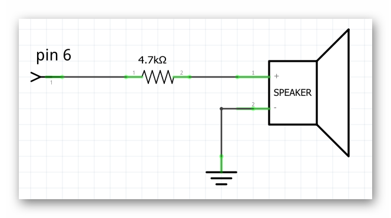
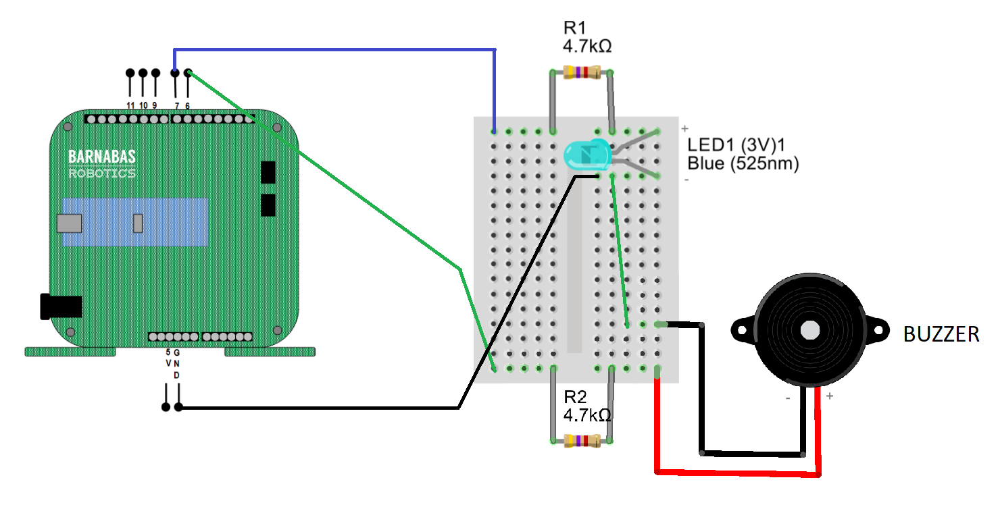
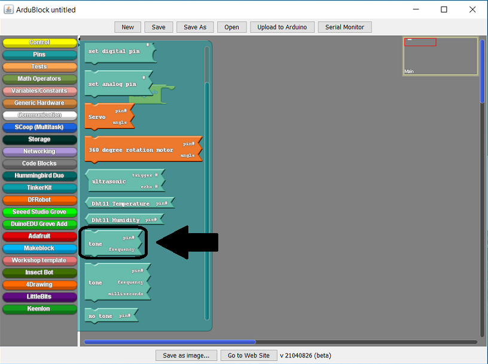
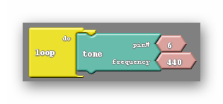
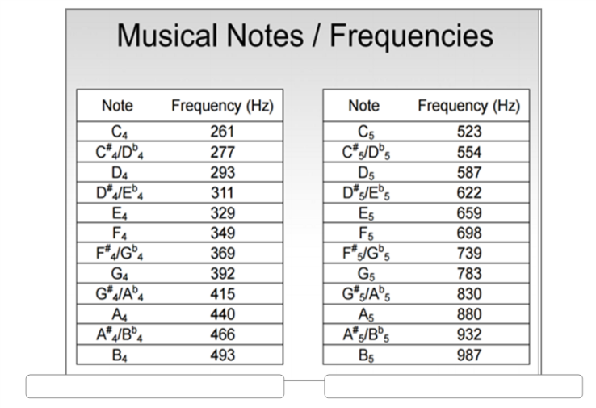
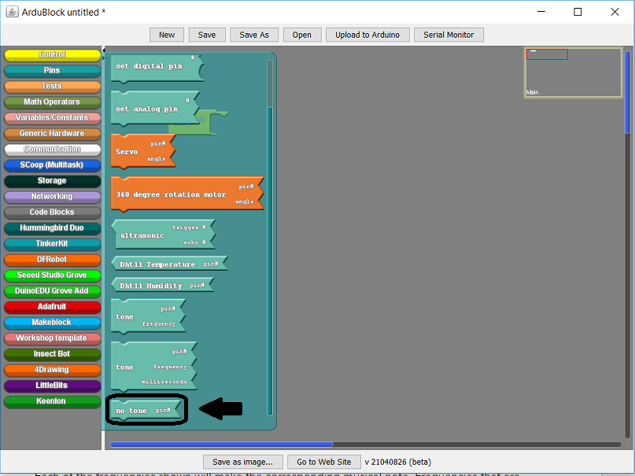
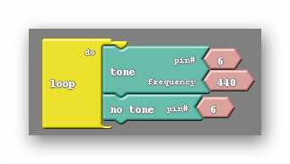
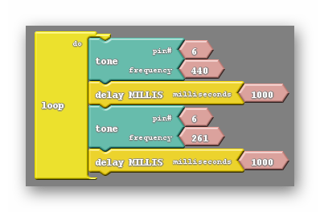

### Step 1: Building The Buzzer Circuit (10 minutes) 
In this lesson we will be adding the buzzer to our robot in the same way we added the LED. There is no need to take the LED circuit off the breadboard. We are not replacing it, we are adding to it. Start by drawing the circuit schematic on the board:

{:class="image "}

In addition to giving the students a schematic to follow have them closely examine the buzzer. They should recognize that one leg of the buzzer is longer than the other, much like the LED. The different length legs, much like the LED indicate that one leg must be placed closer to the positive end of the circuit (the long leg), the high voltage end of the circuit if you will. With this information the students should be able to build the buzzer circuit. It would be wise to construct it a fair distance away from the LED circuit on the breadboard to avoid confusion. If this is not enough then as a class attempt to create a diagram of the circuit on the whiteboard, which would look like the following:

{:class="image fit"}

This diagram has the LED circuit on it as well, but that is not necessary unless you intend to have GND common like in the diagram above. What I mean by that is the green wire that is going between the buzzer circuit and the LED circuit is connecting the negative legs (the short ones) of both components. That way, if one is connected to GND, both are connected to GND.



### Step 2: How Does The Buzzer Work (5 minutes) 
The choice of putting the buzzer on pin 6 is not arbitrary. Pin 6 is what is called a PWM pin, which stands for pulse width modulation. PWM is a fairly complicated process to describe and is beyond the scope of this class. However we can talk about how it functions. A pin that is capable of PWM can vary the voltage that comes from it, as opposed to the other pins which can only give 5 Volts or 0 Volts.

The buzzer will utilize the different voltages by emitting different sounds, different frequencies, depending on the voltage that is currently powering it.

### Step 3:  Making Tones With The Buzzer (45 minutes) 
To program our buzzer we will use the tone block found in the pins tab in Ardublock:

{:class="image fit"}

The tone block, like the set digital pin block, requires us to input two pieces of information. Both the pin the buzzer is located on (pin 6), and the frequency of the tone we would like the buzzer to make:

{:class="image "}

The frequencies that can be chosen relate to different musical note like those shown below:

{:class="image fit"}

Each of the frequencies shown will make the corresponding musical note. Frequencies that are not seen above can be used, but are generally much less functional. Have your students experiment with different frequencies and share any interesting results they may find.

Once the students have had 2-5 minutes to experience with the tone block you should introduce the no tone block:

{:class="image fit"}

The no tone block silences the buzzer. However, much like the LED, we need to be clever in how we code the buzzer so that the buzzer actually behaves the way we want it to.

Let us say that we are trying to have the buzzer make a tone for a small amount of time, then be silent for a similar amount of time. A common mistake is to just put the tone and no tone blocks into the loop do with nothing else accompanying them:

{:class="image "}

I’m not sure how I would describe the noise the above code makes, but it is definitely not what we are looking for. We have the same issue here that we had when first attempting the blinking light code. Neither of these blocks are given time to take place. Delays need to be added so each block has an opportunity to influence the buzzer:

{:class="image "}

Instead of the no tone block, we can just place another tone block of a different frequency to make a siren:

{:class="image fit"}

#### Vocabulary
  * **Tone**: The tone block is capable of making the buzzer emit sounds of different frequencies. To do so the tone block must be given the correct pin number (for us 6) as well as a frequency. The frequency given dictates how high or low the pitch of the sound is and can be related back to musical notes.
  * **No Tone**: The no tone block silences the the buzzer, assuming the correct pin (6) is specified. It does so simply by setting the pin LOW.



{% include badge.html type='best_practice' content='The buzzer can be a force for good or for evil. It is often the case that the sound of several buzzers will be overwhelming. This of course depends on the number of students in your class as well as the physical size of your class. Using the 4.7K Ohm resistors like suggested should mitigate this. You should also keep an ear out for clever students that bypass their resistors altogether, which will create an unmistakably loud tone. Typically I will confiscate buzzers if this occurs.' %}

It is not uncommon to not hear sound after uploading the first time. There are a few common errors that students make when attempting to use the buzzers. Your checklist of things to look for is the following:
  * The general mistakes that prevent code from properly uploading. Also the robot being unpowered. In addition the code may be referencing an incorrect pin.
  * Put your ear to the buzzer. It may in fact be making noise. The 4.7k Ohm resistor reduces the volume tremendously.
  * The circuit may be wired incorrectly. Most often the mistake is that wires are not on the same rows as the legs of the buzzer. The shape of the buzzer can make it difficult to tell which rows the buzzer is sitting on.
      
The students are capable of doing more than just creating simple sirens using the buzzer. They can create a musical scale easily by following the frequency chart. Some of the more ambitious or musically inclined students can attempt to recreate common songs. Perhaps twinkle twinkle little star, or mary had a little lamb. The internet is a useful tool for this activity.