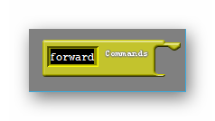
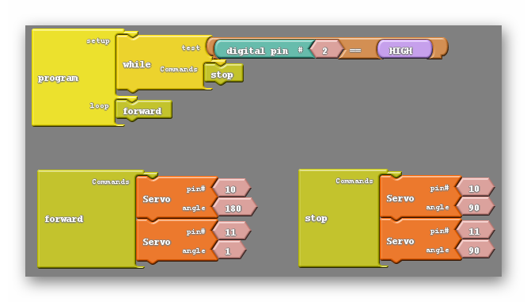
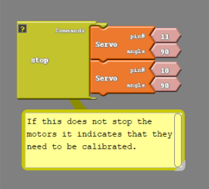
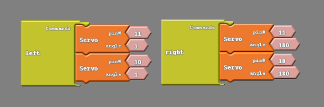

#### Review
   * Previous week  
   * Critical think based on previous question

### Step 1: Commanding Your Robot
Up to this point we have been issuing commands to our robot in a painstaking way. To move the robot forward we need to give orders to two different pins and then specify a time that they continue obeying that order. It would be nice if we could instead give only one order to our robot, like move forward, and have it understand what we mean. I like to think of this like being told to take the trash out. Your parents don't tell you: 

- open the trash can, then take the trashbag out
- tie it
- go outside and put it in the bin
- come inside and put another trashbag in the can
- then close the lid

They just tell you to take the trash out, and you understand the list of steps that make up that chore. How can we make our robot do this? How do we make it understand one command as a longer list of orders?

### Subroutines
We are going to achieve this by using what Ardublock refers to as subroutines. The two subroutine blocks are found at the bottom of the control tab as shown below;

{:class="image fit"}


One of these, the subroutine commands block, is the block we use to teach our robot to do a certain list of orders under a single named command. The other block simply says subroutine, but I like to refer to it as the subroutine run block. This block when placed into our Loop Do will run the list of commands we created earlier. Using the subroutine blocks is different than using the other blocks we have utilized this far. Because of this I'm going to walk through our first subroutine in great detail.

#### What Is A Subroutine?
The first subroutine we are going to make will move our robot forward, something we have done twice already. We will start by dragging a Loop Do into the coding environment (unless one is already there) and also dragging a subroutine commands block into the environment as well. Unlike all the other blocks in Ardublock, we are not going to attach the subroutine commands block to the Loop Do.

{:class="image fit"}

If you are following along using Arduino without Ardublock, notice in the code below that we first declare a function called “forward()”.  We must do this before we call it in the “loop()” function.  

```
#include <Servo.h>

Servo servo_pin_11;
Servo servo_pin_10;


void forward(){
  servo_pin_11.write( 1 );
  servo_pin_10.write( 180 );
}

void stop(){
  servo_pin_11.write(90);
  servo_pin_10.write(90;
}

void setup()
{
  servo_pin_11.attach(11);
  servo_pin_10.attach(10);

  While (digitalRead(2)==HIGH){
    stop();
  }
}

void loop()
{
  forward();
}
```

#### Let's Make One…
The subroutine commands block is strange for another reason. We can change what it is called in the same way we can change number values in our other blocks, by left clicking on the word subroutine you open a text box that you can type in. I'm going to erase the word subroutine and replace it with forward.

{:class="image "}

I'm just doing this so that in the future, when we have more than one subroutine, giving my robot the command I want will be easy. The only thing I'll need to remember to go forward is the word forward. Now we need to input the list of orders that the robot will do whenever we say forward. We'll just use the code from the last section;

{:class="image "}

#### Calling A Subroutine
Now we only need to put a subroutine run block inside of our Loop Do and rename it forward as well;

{:class="image "}

Rather than the simple code above, you could add your newfound knowledge of subroutines to the code we've created which utilizes the button;

{:class="image "}

#### How Do Subroutines Help Me?
You're probably thinking 'What was the point of all this? This was more work than before!' Well for now it seems that way, but before we're done with this class our robot is going to be navigating through very complicated paths, and we will need to give our robot several commands. At that point this process becomes extremely worthwhile. The way I put it is that we do a lot of work up front so that the rest our code is easier to write.

### Step 2: Now it is your turn !(45 minutes) 
#### Create The Following Subroutines
| Name | Action |
|*stop* | Stops all motors |
|*rstop* | Stops the right motor only |
|*lstop* | Stops the left motor only |
|*left* | Moves the left motor forward only |
|*lback* | Move the left motor backward only |
|*right* | Moves the right motor forward only |
|*rback* | Moves the right motor backward only |
|*forward* | Moves both the left and right motor forward. |
|*back* | Moves both the left and right motor backwards. |
|*blink* | Blinks the LED light at whatever speed you want |
|*forwardhalf* | Move forward at half speed. |
|*backhalf* | Move backwards at half speed. |

### Test It Out!
1. Write a program that moves the car forward for 1 second, stops for 1 second, goes backwards for 1 seconds and stops for 1 second using your subroutines.
2. Retry your turning challenges from the previous lesson by using your subroutines.
3. Create a subroutine that tells your robot to turn left 90 degrees.
4. Create a subroutine that tells yoru robot to turn right 90 degrees.
5. Make up a programming complex programming challenge and use your new subroutines to achieve your goal!

#### Answers

{:class="image "}
{:class="image "}
{:class="image "}
{:class="image "}