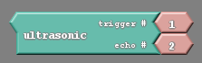

#### Review
   * Previous week  
   * Critical think based on previous question

### The Road Thus Far
With both the motors and the ultrasonic sensor working properly we have all the tools we need to create an autonomous program that can avoid obstacles. Our robot has finally gotten to the point that it can act independently of us in a semi-intelligent way. All that is left of us to do is effectively marry the motion of the robot to its ability to sense objects. Effectively utilize the robot’s inputs to direct its outputs.
	
To help us create the avoidance code we are going to use a few of the tools we have constructed over the course of this class. The first being all of the subroutines we made previously;

{:class="image fit"}

On top of that, we will use our button as a start stop mechanism;

{:class="image fit"}

Keep in mind that these tools merely add convenience. 

### Adding The Sensor	

Lastly comes the new wrinkle. Our robot is going to attempt to avoid obstacles using the ultrasonic sensor. To avoid obstacles it needs to be able to adapt different behaviors. It needs to be able to react. For that reason we will add the if/else block;

{:class="image "}

We have used the if/else block before. Remember that it chooses one of two paths of action after determining the truth of a condition.

Now we need to determine what the condition will be. I want the condition to be some kind of comparison. I want to have some set distance which I dictate is ‘too short’ for my robot and I want the robot to react when that distance threshold is crossed. In other words, I want to compare the number given by the sensor to a preset number of my choosing;

{:class="image "}

Above I have the condition being, ‘when the distance is less than 20cm’. Now I need to decide what happens in that case, and what happens elsewise. If the robot is within 20cm of an obstacle, I should have it turn to avoid it. Otherwise, it should be fine moving straight forward;

{:class="image "}

Because each robot behaves differently, the delay each student uses may be slightly bigger or smaller than the one used above. As a matter of fact I think I should add a couple additional delays to clean up our code;

{:class="image "}

The delay block just after the while loop will give me some time to remove my hand from the robot after pressing the button, ensuring that I don’t accidentally knock the robot off course. The last delay, underneath the forward subroutine, just serves to slow things down so that we avoid asking for the distance too often. If the ultrasonic sensor is triggered too often the sound waves it makes may start to interfere with each other.

Keep in mind that your avoidance code can be more complex than my example above. Often I have students that insist on creating code with a little more personality as a way of giving their robots’ an identity, such as below;

{:class="image "}

Notice this code does not have the quality of life improvements I previously mentioned.

#### Bullet Proofing Your Code

There is one more potential hurdle to getting your avoidance code to work, and it has to do with the ultrasonic sensor’s max range. Remember that if an object is out of range for the sensor that it will give a value for distance of 0. This is a huge problem as a value of zero will cause our robot to turn as if it is avoiding an object. Furthermore, we can start getting false 0 readings when the batteries powering the robots are low. 

As it turns out, we can account for these shortcomings in our hardware through code. We can add another statement to our conditional logic so that the distance read needs to be lower that 20, but not zero, in order to turn;

{:class="image "}