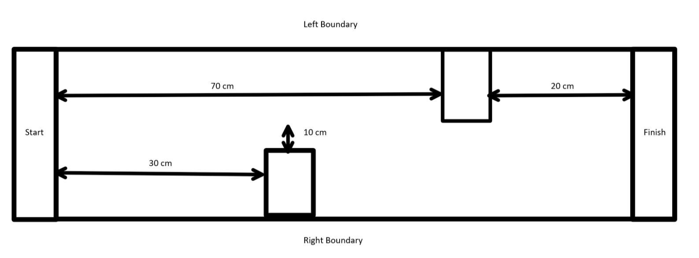

### Step 1: Setup the Course (15 minutes) 
Now that your robot can move (motors), see (ultrasonic sensor) and touch (button), let's do our final challenge.

Your robot will need to go through an obstacle course without running into anything.  The student with the fastest time will win.  Good luck!

{:class="image fit"}

At first glance you may think that this obstacle course can be navigated without using the ultrasonic sensor, and you would be correct. But the ultrasonic sensor gives us greater precision in the navigation of the course. The sensor lets robot decide when it is best to implement turns, rather than hoping our preset turns are happening at appropriate times. As a matter of fact, try to complete the course without using the ultrasonic sensor before attempting it with the sensor. Feel free to add to the course as well, requiring the bots to blink at specific points before finishing the course, or having the wheels start at specific locations.