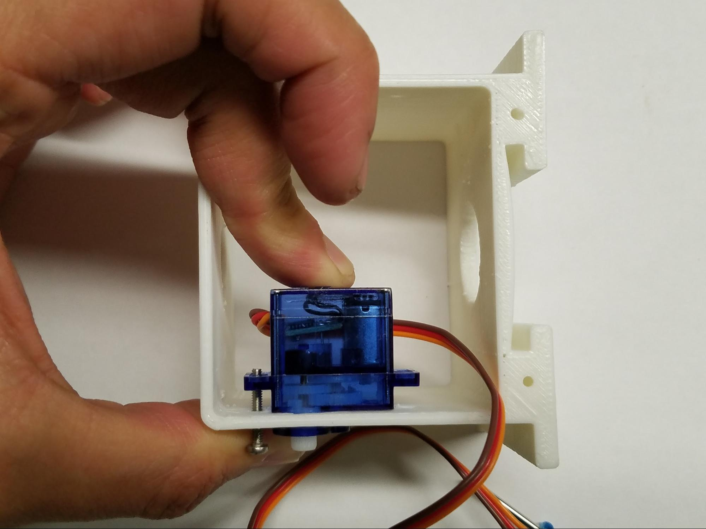





### Step 1: Attaching The Servo Motors
Servos motors are used to move your robot's right arm, left arm, and head.  Servo motors can move a half-circle (or 180 degrees). Follow the below steps to attach the servo motors:

{:class="image right"} Take one servo motor and place it into the left arm socket of the robot body.  Note:  The servo motor should be placed inside of the plastic robot body casing.  The top of the motor (with the white plastic tip) will stick slightly out of the robot’s body.  (See photo.)
{:style="overflow: hidden;"}

{:class="image right"} 
Take one 9/16" servo screw and put it through the outside of the body and into the corresponding hole on the wing of the servo motor.  Push it through so that you can see the screw stick out through the wing of the servo motor.  If you have trouble sticking the screw through, try using the screwdriver to screw it in.
{:style="overflow: hidden;"}

{:class="image right"} Take a nut and place it over the tip of the 9/16" servo screw.  Then, while gently holding the nut in place with your finger, tighten the 9/16" servo screw using your screwdriver. (Be careful not to over tighten.)  (This may require some patience and perseverance.  But you can do it!)
{:style="overflow: hidden;"}

{:class="image right"}  
Once your nut is secure on your servo screw, it should look like the photo.
{:style="overflow: hidden;"}

{:class="image right"} Repeat the above instructions for the other wing of the servo motor.  Once completed, your servo motor should look like the photo.  
{:style="overflow: hidden;"}

{:class="image right"} Now, repeat the above steps for the other arm hole.  Once you have finished, your robot's body should look like the photo below.
{:style="overflow: hidden;"}

{:class="image right"} Now that your two arm motors are assembled, take the last servo motor and fit it into the third servo motor socket on the top of the robot body.  This third motor will be for your robot's head.  Repeat the steps above to attach this third servo motor to your robot body.  
{:style="overflow: hidden;"}

{:class="image right"} Once completed, your robot should look like this.
{:style="overflow: hidden;"}

#### Vocabulary
   * **Fastener**: a hardware device that mechanically joins or affixes two or more objects together.

### Step 2: Frontplate Assembly
In this step, you will now cover your robot's motors by installing your faceplate by following the steps below:

{:class="image right"} Find the front of your robot body.  (Hint: It is the open side of the body that is closest to the arm motors and has 2 holes at the bottom.)  Align your faceplate to your robot’s body so the screw holes line up.  (See photo.)  
{:style="overflow: hidden;"}

{:class="image right"} Using your miniature Phillips screwdriver, fasten the two 1/4" screws to the robot’s body.
{:style="overflow: hidden;"}

{:class="image right"} Once completed, your robot should look like the photo.
{:style="overflow: hidden;"}

### Step 3: Attaching The Backplate
In this step, you will now cover the backside of your robot's body by installing your Barnabas Noggin. Follow the step below:

{:class="image right"} Find the back of your robot.  (Hint: It is the open side of the body that is furthest from the arm motors with 4 holes.)  Align your Barnabas Noggin to your robot’s body. The screw holes on the four corners of the robot body and the Barnabas Noggin should line up.  (See photo.)  
{:style="overflow: hidden;"}

{:class="image right"} Next, screw in the four 1/4" screws into the four holes using your screwdriver. 
{:style="overflow: hidden;"}

{:class="image right"} Once completed, your robot should look like the photo.
{:style="overflow: hidden;"}

### Step 4: Attaching The Arms
Now you will connect your arms to your robot's body by following the steps below:
{:class="image right"}  Take one 9/16” servo screw and put it through one of the arm’s holes.  Screw on one nut to the other side of the servo screw--but only part of the way.  Be careful not to screw the nut in all the way.  (See photo.)
{:style="overflow: hidden;"}

{:class="image right"} Take the arm and hold it up to the servo motor shaft (i.e. white plastic tip of the servo motor) as shown below.  The hole in the arm should match up with the hole on the servo motor shaft.
{:style="overflow: hidden;"}

{:class="image right"} Next, using the screwdriver, tighten your servo screw by turning clockwise.  (Be careful not to over tighten.)  (See photo.)
{:style="overflow: hidden;"}

{:class="image right"} Once the arm is tightened, it should look like the photo.
{:style="overflow: hidden;"}

{:class="image right"} Now, repeat the process above for the other arm too.  Once you are finished, your robot arms should look like the photo. 
{:style="overflow: hidden;"}

### Step 5: Attaching The Head
Every robot needs a head! You will be fastening the head to the servo motor sticking out of the top of the robot as described below:

{:class="image right"} Find the bottom of your head (i.e. the base) and align the hole to the top of the hole on the servo motor shaft head.  (See photo.)  
{:style="overflow: hidden;"}

{:class="image right"} Fasten the screw.
{:style="overflow: hidden;"}

{:class="image right"} Now fasten the top of the head to the bottom part.  It should fit in over the top.  You may want to use glue (Elmer’s glue or super glue) to secure it further. 
{:style="overflow: hidden;"}

