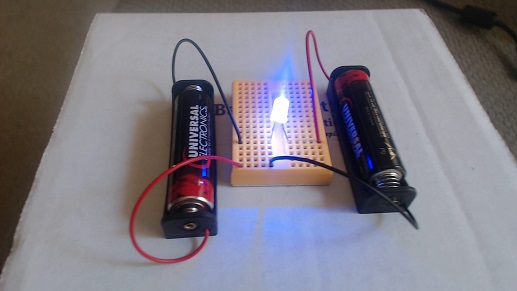

### Review
   * What is resistance? What is the job of a resistor in a circuit?

### Step 1:  Connecting The Barnabas-Bot (10 minutes) 
Rather than go through the process here, please look at the Additional Resources provided in the Lesson overview. There are two separate documents. One for Mac users and one for PC users. There you will find instructions to connect the Barnabas-bot to the computer. They will also include instructions on how to ensure the robot and computer can communicate with one another (upload code). 

#### Vocabulary
   * **Arduino**: Both hardware and software. The hardware is a line of microcontrollers (very simple computers). In fact, the Barnabas Noggin utilizes an Arduino microcontroller itself. The software is a C based IDE (integrated development environment… A place where you code). Because Arduino handles both sides of things the process of coding, then uploading your code to a microcontroller is very easy. The Arduino IDE can be out of scope for younger classes as the ability to type acts as a barrier to entry.



Use the following checklist to prepare your robot for coding:

   1. Turn on the computer.
   2. Input password.
   3. Open Arduino.
   4. Plug the robot into the computer via the USB cable.
   5. Go to tools -> port -> select port (not com1 or serial port ex. for windows pc).
   6. Go to tools -> board -> select Arduino Nano
   
_This process must be done each lesson that you intend to program._

### Step 2: Getting Started With Ardublock (5 minutes) 
Now that our computer is talking to our Barnabas Noggin, let's get started with ArduBlock!  ArduBlock is a block-based programming language that is great for those who are new to programming.  

Open ArduBlock by going to TOOLS->ARDUBLOCK.

{:class="image "}

Once ArduBlock opens, you should see the following screen.  Note that your screen may differ a little depending on which version of Ardublock you have installed.

{:class="image "}
  
Go to `CONTROL`, and drag in a `LOOP-DO` block (if it isn't there already).  Click on `SAVE`, type in your name, and click `SAVE` again.  Note that every program needs a `LOOP-DO`.

{:class="image "}
  
Now click `UPLOAD`, type in your name, and click `SAVE`.  Your program will now upload code into your robot. 

{:class="image "}
  
Congratulations, you just wrote your first program!  In the future, you will want to always click `SAVE`, and then `UPLOAD` when loading your program to your Barnabas-Bot.

#### Vocabulary
   * **Ardublock**: A GUI (graphic user interface… another place to code) that runs with Arduino. This means that closing Arduino also closes Ardublock so be careful! Ardublock is a block based coding platform, allowing us to sidestep the need to type.



### Step 3: Ardublock Basics (5 minutes) 
Before we can begin coding we should familiarize ourselves with the basics of ardublock. How to move around, create and delete code.

The first thing to mention is the loop do. The loop do is the most important block in Ardublock. Code is only able to be uploaded to your robot if there is one and only one loop do. The loop do will house any other blocks used in our code and will change its size to accommodate. As inferred by its name, the loop do will loop through your code. When it reaches the end of your code, it will start again at the beginning. Luckily for us, this integral part of our code will always be in a new Ardublock file by default. 

Let’s say that the loop do is not there when opening Ardublock. We can add the loop do to the code, as well as any add any other block, by the following method. All of the colored tabs on the left side of the Ardublock window can be selected. After selecting one of them a menu will pop up with several similarly colored blocks. You can drag any of the blocks into the grey coding area (generally putting them inside of the loop do.

In the case of the loop do you would navigate to the yellow tab labelled control, then drag and drop loop do into the gray area.

{:class="image "}

The last skill we need to learn is how to delete blocks of code. Say we have the case of multiple loop do’s, and we want to get rid of the extras. Just use your cursor to grab one of the unwanted blocks and drag it over to the tabs on the left side of the window. Then, just drop it and it should disappear.

#### Vocabulary
   * **Loop Do**: The most important block in Ardublock. It is important that one and only one loop do is in the code at a time, otherwise your code cannot be uploaded. The loop do will run whatever code is placed inside it repeatedly, starting again at the beginning whenever the end is reached.

### Step 4: Our First Program, Programming The LED (20 minutes) 
In this section we are finally going to code our LED. However, we must make a small change to the current circuit first. 

The wire that is currently in the 5V pin must be placed in the pin labelled 7.

{:class="image fit"}

You may notice that the LED no longer turns on. This is because while the 5V pin is always on, pin 7 is what is called a programmable pin, meaning we decide whether it is on or off with code. 

With that out of the way let’s begin coding by grabbing a Set Digital Pin block out of the Pins tab and place it in the loop do.

{:class="image "}

The `Set Digital Pin` block should snap into place when dropped on the loop do.

{:class="image "}
  
There are two smaller blocks attached to the `Set Digital Pin` block. The number 1 and the word `HIGH`. The number 1 refers to the pin on the robot that this block will attempt to control. Remember that we placed the LED circuit on pin 7, so that 1 needs to be changed to a 7. This can be done by clicking on the block, pressing 7, then pressing enter.

The `HIGH` block is telling us that it will be turning the pin on (giving it power). By mousing over this block with your mouse cursor and clicking on the upside down triangle that appears on it a menu will appear. That menu has only two options `HIGH` and `LOW`. As you may have guessed LOW will turn the pin off.

After changing the pin number to 7 have all the students press upload to arduino at the top of the Ardublock window. You will be prompted to save, go ahead and do so. Afterwards you will see a green progress bar in the Arduino window showing the code being uploaded. You should see the LED turn on. 

Next you should ask the students to turn the LED off by changing the code. Let them figure out how to do so on their own (Switch the HIGH to LOW). In order to see the change the students will need to upload their code again. The Barnabas Noggin is only capable of holding one program at a time. This means that uploading the LED off code will permanently erase the LED on code from the robot. To turn the LED on again they would have to re-upload a set digital pin HIGH code to the robot.

LED on {:class="image "}  {:class="image "} LED off

#### Vocabulary
   * **Programmable pin**: One of the pins on the Barnabas Noggin labelled 0-13 (it has more labelled A0-A5, but we are not using those in this class). These pins can be controlled by the code we create in Ardublock rather than just being innately on or off.
   * **Set Digital Pin**: Located in the aqua colored pins tab, this is the block we use to turn the LED on and off. To properly use this block we need to pick a pin number (for us 7) and choose between HIGH or LOW (on or off). This block must be placed inside the loop do.

### Step 5: Blinking The LED (20 minutes) 
Now it’s time for the big challenge, blinking the LED. I generally start by asking the class for suggestions on how to do this. The answer I’m looking for at this point is that we should place another Set Digital Pin block into our loop do. By having two `Set Digital Pin` blocks, one `HIGH` and the other `LOW`, We should see both behaviors happen. Have the students do this and upload the code. What kind of behavior do they see?

{:class="image "}

They should see the light turn off momentarily before turning back on, and staying on there after. Don’t be fooled by the initial turning off of the LED, that is not do to our code working as intended. The Noggin will always stop whatever it is doing to accept new code. In this case turning the LED off just after our code is uploaded. Unfortunately this is not part of a blink. Because the loop do repeats we should see the LED blink over and over, which we do not with the code as written.

The reason we can not see a repeated blink is due to the speed at which the Barnabas Noggin is processing commands. The Barnabas Noggin thinks fast enough to do hundreds of commands in a second, far to fast for our eyes to keep up with. The LED is blinking, but too fast for us to make out.

There is a way to slow our code down deliberately. In the controls tab there are two blocks labelled Delay. One says `Delay milliseconds` (a _milli_ second is one *thousandth* of a second), and the other says `delay microseconds` (a _micro_ second is one *millionth* of a second). We will always use the Delay milliseconds block, as the Delay microseconds block yields the same problem as before; the LED will be blinking too fast for us to see. The question is where do we place the Delay millisecond block in our current code. There are two immediate options:  

{:class="image "} {:class="image "}

You're probably wondering why there isn’t a third option for the delay block bing at the top of the code. It turns out that would be identical to the code on the left due to the code repeating. Unfortunately, these don’t work either. The one on the left seems to stay off, and the one on the right seems to stay on. In either case the delay block is only pausing after one of the actions, either turning off or turning on. We need to pause our code after each action, allowing both of them to happen for some observable amount of time, like below:

{:class="image "}

#### Vocabulary
   * **Delay**: The delay block comes in two different flavors, delay milliseconds and delay microseconds. We only make use of the delay milliseconds block. The delay block will stop code from progressing forward until a certain amount of time has elapsed.

