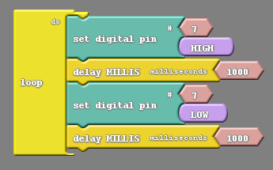
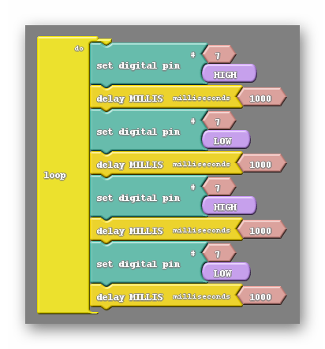
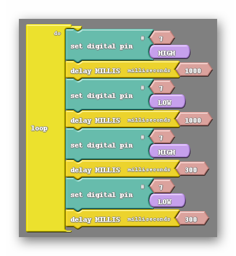
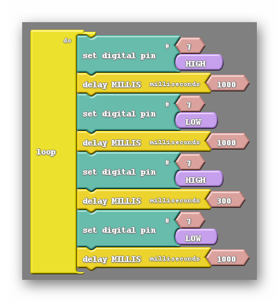
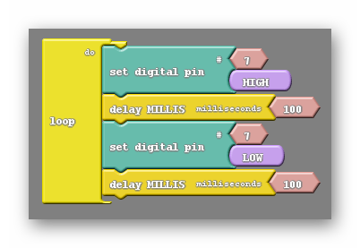
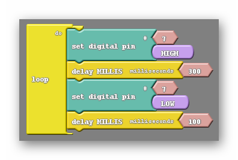
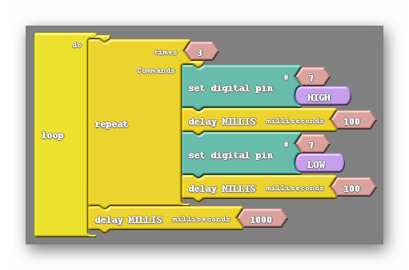
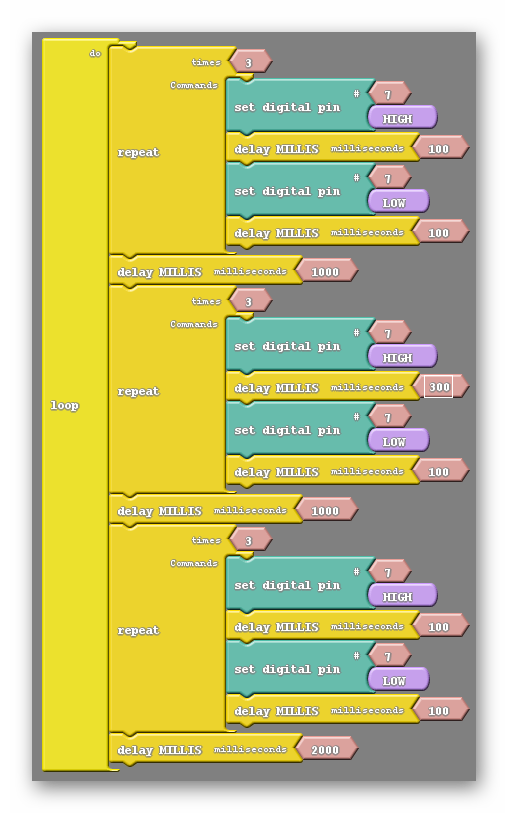

### Review
   * What block is used to turn the LED on and off.
   * How is the delay block important in getting the LED to visibly blink?

### Step 1: Blinking At Different Speeds (25 minutes) 
We spent last week learning to blink our LEDs and playing with the speed at which it blinks. We are going to pick up where we left off by using the skills learned last week. The first challenge of this lesson is to create a program that causes the LED to blink at two distinct speeds. It will be on for a long period of time (long as in about a second), then off, then on for a short period of time, then off. 

How should our code from last week, the blinking light code, be altered to accomplish this? Well we need to first understand we will need two different blinks, and will therefore need more blocks. If we stick to the status quo of four blocks in our code we will be limited to only one of the two behaviors; either the fast blink or the slow blink.
  
{:class="image "}
One blink
{:class="image "}
Two blinks
	
In the example on the right we have enough blocks to create two distinctly different blinks, however at the moment the code on the right and the code on the left behave identically. Why is that?

The right hand code may have enough blocks for two blinks but currently all of the delay blocks have the default value of 1000. So in either code every blink we see will be the same length of time. In order to vary the blink speeds we need to alter the value of one or more of the delay blocks. The question is which delays need to be altered? Let’s have a look at the code below:
  
{:class="image "}

You can see here that the first two delays are kept at the same value, and the last two delays are kept at the same value. They are separated into two blinks, each with their own specific delay. There is a small problem with this code however, which will be apparent as you watch the LED. The second blink, in particular the low part of it, is short enough that the blink becomes hard to distinguish from the longer blink. This can be solved by making sure that the delays after set digital pin LOW blocks are equal in value, like in the example below:

{:class="image "}  

With the delays set at these values both blinks will be clearly visible as separate blinks and it will be clear that one is longer than the other.

### Step 2: What Is Morse Code (10 minutes) 
In order to accomplish this lessons challenge we first need to understand morse code. Both what morse code is as well as how it is used. Morse code is essentially an alternate way of producing the alphabet using an assortment of dots and dashes to represent any one letter. A message in morse code is usually conveyed through either light or sound rather than just on paper. At this point I’d like you to look at the morse code PDF located here as well as in the additional resources section at the top of the lesson. This is a resource that you should consider distributing to your students.

That PDF does ask that the short and long blinks be timed in a different manner. It asks for significantly shorter blinks in both cases, which would look like the following:

{:class="image "}
Short blink. A dot.
	  
{:class="image "}
Long blink. A dash.
	
In addition the morse code pdf gives us rules for ending letters and ending words. We are told to have a 1000 millisecond delay at the end of a letter and a 2000 millisecond delay at the end of a word. This helps us interpret the morse code message a little easier, as we can better distinguish between individual letters and words.

#### Vocabulary
   * **Morse Code**: A method of transmitting information as a series of on-off tones, lights, or clicks that can be interpreted by a skilled observer without the use of equipment.

### Step 3: Our First Morse Code Message (20 minutes) 
Morse code is probably most commonly known as as an emergency method of communication, with the most commonly known message being S-O-S (help). This will be the first message we try to create using the LED. It is actually one of the easiest messages to create in morse code as S is represented by three dots, and O is represented by three dashes. Because both S and O are defined with repetitive signals it would be best for me to introduce a new block.

The repeat block can be found in the control tab. It is the first of the three repeat blocks seen, the others being repeat and count, and repeat between. This block behaves somewhat like the loop do in that other blocks can be placed inside it. There is a small integer block attached to it, much like the other blocks we have used thus far, which can have its value changed. That number will dictate how many times the code within the repeat block will run before further blocks in your code are. Take a look at the example below:
  
{:class="image "}

This code will blink fast three times before waiting a second, then starting over. Based on what we already know, this code creates the message S-S-S-S-S….. 

Putting together the rest of the S-O-S code should be easy to accomplish. We just need to add three long blinks, followed by three more short blinks, with the appropriate delays in between.
  
{:class="image "}

Notice that the last delay is for 2000 milliseconds (2 seconds). This is appropriate if we consider S-O-S to be a word.
#### Vocabulary
   * **Repeat**: The repeat block, like the loop block, can have other blocks placed within it. Any blocks within the repeat block will be run a number of times equal to the integer that innately comes with the block. Afterwards, subsequent blocks of the code will be run as expected.

