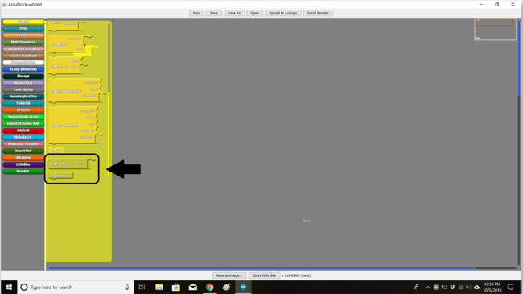
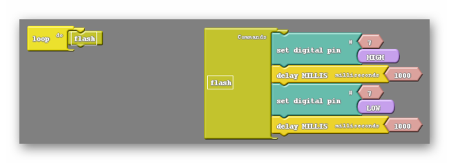

### Step 1:  Subroutines (60 min)
{:class="image fit"} 

In Ardublock we can code using what are called subroutines, which can be found at the bottom of the control tab.  

The two subroutine blocks available are the subroutine commands block and the subroutine block ( which I will refer to as the subroutine run block). Upon closer inspection of the two blocks I can see that only one of them fits into the loop do:

{:class="image "}

The subroutine commands block acts as a place to hold code. If we subroutine commands block contains other blocks in it we can use the subroutine run block to reference that code later. Here is an example:

{:class="image "}

Inside the subroutine commands block you can see I have recreated the blinking light code. Also, I have renamed the subroutine commands block to flash. The exact same has been done to the subroutine run block, which also reads flash. When the code attempts to run the loop do sees flash and tries to find a subroutine command block with the same name. If it is successful in finding an identically named subroutine command block it will essentially insert all blocks within that subroutines command block into the code. Looking above you can think of the block inside the loop do as a placeholder for all of the blocks inside the subroutines command block.

The real question is why is this useful? Haven’t we just made more work for ourselves? Well, yes and no. In the example above the use of subroutines is unnecessary, but as we aspire to create more and more complex code subroutines become a powerful tool. Take a look at the list of tasks I want my robot to do below:

1. Wave its right hand
2. Blink
3. Make a siren noise for several seconds
4. Wave its right hand again
5. Dance for a few seconds

Doing this without subroutines will take  much work and be difficult to keep organized. However if I take the time to create subroutines for each of these actions I can clean up the code inside the loop do tremendously:

{:class="image "}

Notice that in the code above some subroutines are used multiple times. This is done while only making one subroutines command block per each distinctly named subroutine. You can see that in this case, where some subroutines are run multiple times, having subroutines is much better than not. In addition to that the code is much easier to read and understand.

#### Vocabulary
 * **Subroutine**: A set of instructions designed to perform a frequently used task. In Ardublock the subroutine blocks consist of the subroutine commands block, which holds the instructions, and the subroutine (run) block, which fits into the loop do.



