# Appendix C: Wood Bot Addendum
### Step 1: Identifying The Parts

The laser cut wood version of the barnabas bot has a body made up of distinct parts that fit together like a jigsaw puzzle. Because of this it is very important that we can easily identify all of the parts as well as how they should be oriented.

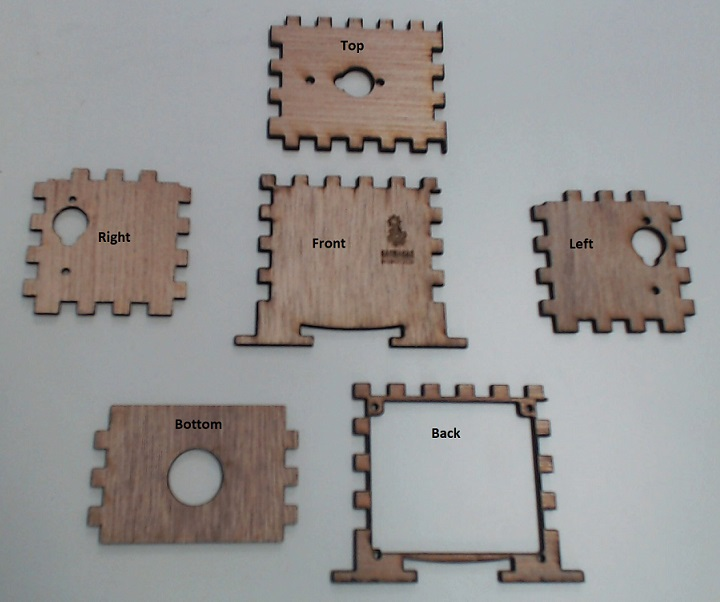{:class="image right"} Array all of the wood pieces and make sure that you have all of the pieces shown in the picture to the left.
{:style="overflow: hidden;"}

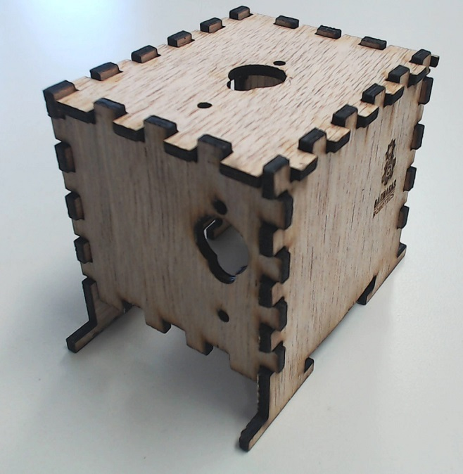{:class="image right"} 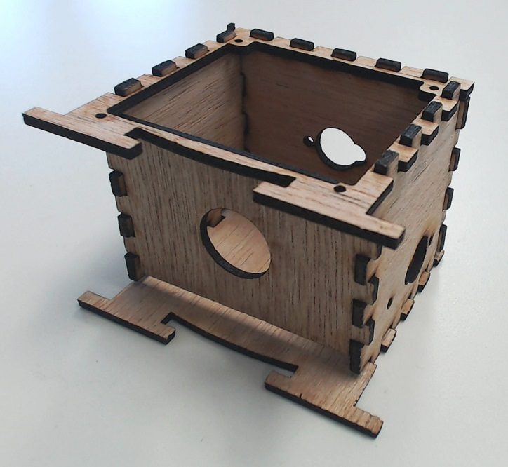{:class="image right"} Without any glue, put the wood pieces together. It should become fairly obvious that the full robot body will only fit together if the parts are oriented a certain way. This means that for each piece there is an inside edge and an outside edge. After fitting all the pieces together mark the inside faces with a pencil.
{:style="overflow: hidden;"}

### Step 2: Placing The Noggin and Servo motors

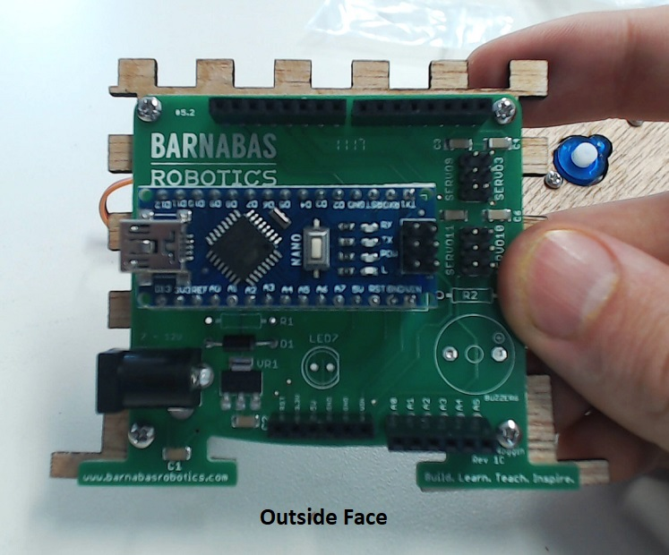{:class="image fit"}
- Now, disassemble the body and fasten the noggin to the back plate using the screws provided with the noggin on the outward face.

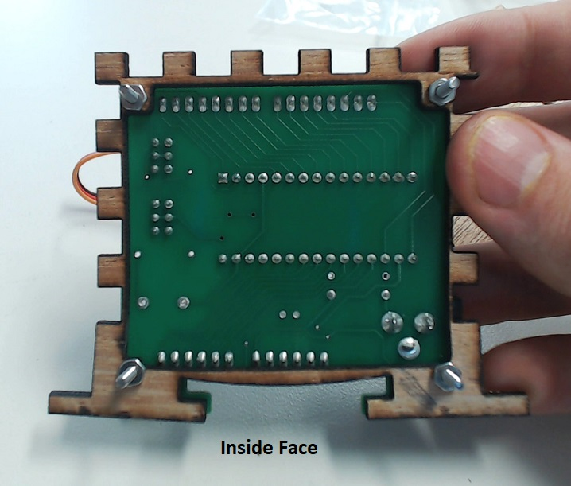{:class="image fit"} 

- Likewise fasten the motors to the left, right, and top plate with the motor placed on the inside face of each plate.

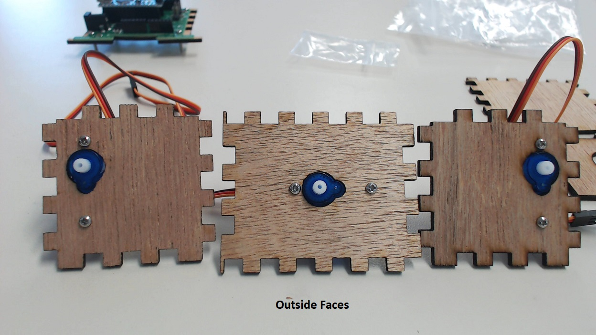{:class="image fit"} 
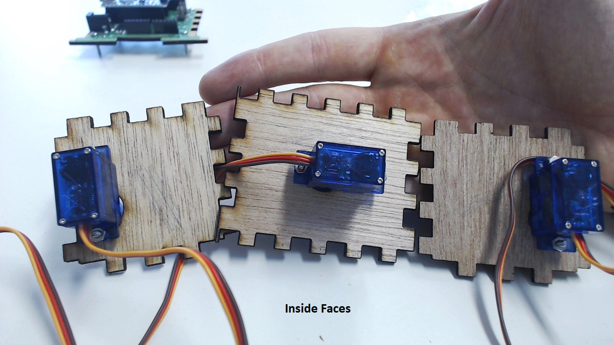{:class="image fit"} 

### Step 3: Gluing The Robot Together

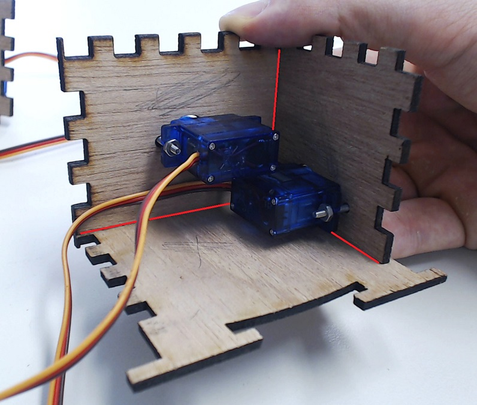{:class="image fit"}

- Begin to reassemble the robot body, this time applying glue to keep everything in place. There are several ways to glue the robot together and I will only be highlighting one. I generally will apply glue to the inside seam between two plates like shown in the picture to the right. The red lines indicate where the glue is to be placed. This can be done with elmers glue but can also be done with certain super glues such as crazy glue. In either case it may be difficult to reach every corner of the robot and I would recommend using a skinny popsicle stick or a small brush to apply the glue. If you choose to use super glue be sure to handle the glue yourself and keep out of the reach of your students. Be sure to add the back plate after adding the bottom plate.

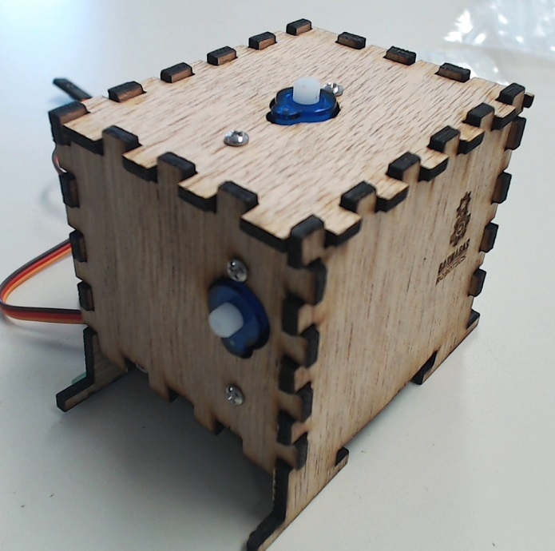{:class="image fit"} 

- Your robot assembled up to this point should look like the pictures to the right.

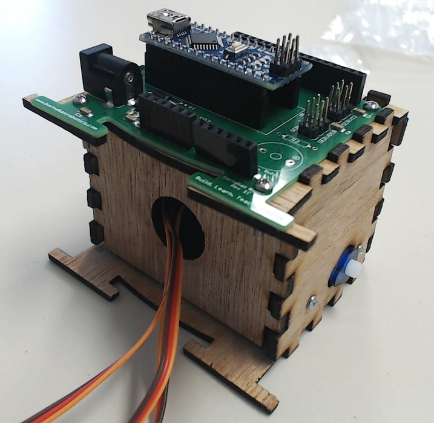{:class="image fit"}

### Step 4: Decorating And Adding The 3D Printed Parts

- This would be a great point to pivot to decoration. The students can use colored pencils, markers or sharpies to color both the wood parts as well as the 3D printed parts we have yet to add to our robot. Of course if you are using slow drying glue this step should wait.

- Fasten the 3D printed head and arms to the motors. This is conducted in exactly the same way as the week 11 lesson, so more in depth instructions are provided there.

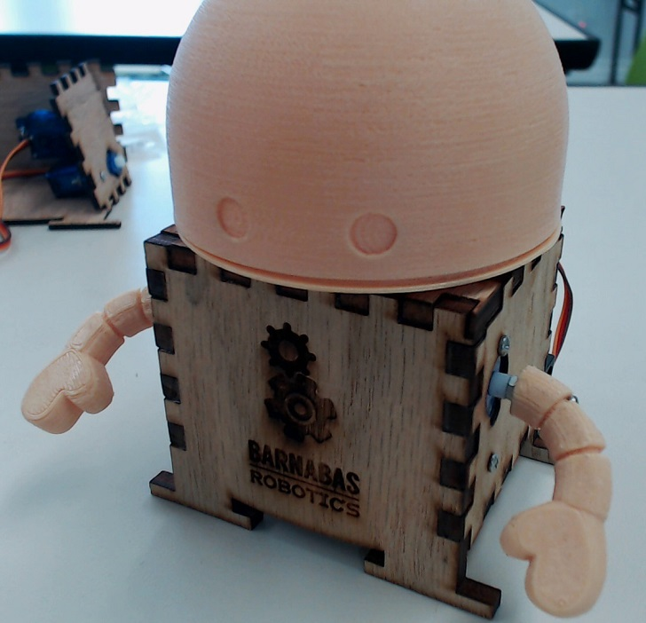{:class="image fit"}
