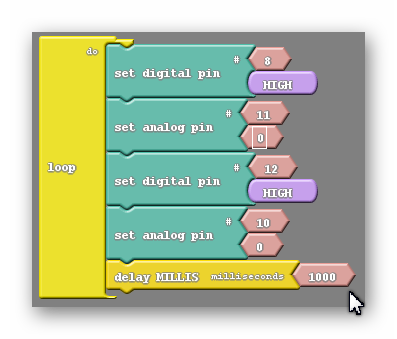
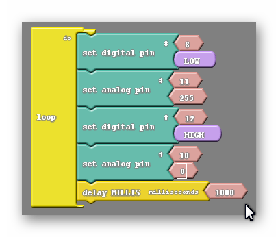

#### Review
   * Previous week  
   * Critical think based on previous question

### Controlling Motor Speed (15 minutes) 
#### What Do The Angles Mean
You can change the speed of your motor by using different angle values.  See the table below.

 
| Angle | Direction | Speed |
|  ---  |    ---    |  ---  |
|  0    | Clockwise | Full  |
| 1-89  | Clockwise | Partial |
| 90    | None      | Zero  |
| 91-179| Counter Clockwise | Partial |
| 180   | Counter Clockwise | Full |



{:class="image "}

#### Similar But Not Equal
Keep in mind that there are multiple subroutines that you can construct that can do something like turn left or go forward, but they aren't exactly equivalent. For example;

{:class="image "}

in the above example both subroutines will turn the car left. However one causes the left wheel to rotate backward while the right wheel remains still. The other causes the right wheel to move forward while the left wheel remains still. Either of these subroutines are effective but they end up giving your robot different behaviors. Having your robot backup slightly or move forward slightly while performing a turn could have a big impact when navigating obstacles. Worse yet, you may program the right turn in one way but the left turn in the other, leading to desynchronized behavior between the two turns, which can be very frustrating.

### It's Your Turn!
Now that you know how to control speed, try the following challenges.  The following should only run one time (once your press your button)

#### CHALLENGE #1
1. Move your car forward at 100% speed for 1 sec
1. Stop for 1 sec
1. Move your car backward at 100% speed for 1 sec
1. Stop for 1 sec

#### CHALLENGE #2
1. Move your car forward at 50% speed for 1 sec
1. Stop for 1 sec
1. Move your car backward at 50% speed for 1 sec
1. Stop for 1 sec

#### CHALLENGE #3
1. Move your car forward at 100% speed for 1 sec
1. Stop for 1 sec
1. Move your car backward at 50% speed for 1 sec
1. Stop for 1 sec

#### CHALLENGE #4
1. Move your car forward at 25% speed for 1 sec
1. Stop for 1 sec
1. Move your car backward at 50% speed for 1 sec
1. Stop for 1 sec

#### CHALLENGE #5
1. Spin 360 degrees at 100% speed 
1. Stop

#### CHALLENGE #6
1. Spin 360 degrees at 50% speed 
1. Stop

#### SPEED CONTROL QUIZ
Try to guess the nature of each of the subroutines below. Feel free to experiment using your robot;

{:class="image "}

### Answers  
A: Backwards very slowly.
B: Turns left very slowly while backing up.
C: Moves forward at less than half speed.

#### DC Version



### Motor Speed Control and the Set Analog Pin Block
#### The Set Analog Pin block
So for we have been making use of the set digital pin block to move our robot. This works but has it's limitations as we can only make a voltage difference of 5V or 0V between our pins, meaning we can only go full speed or stop completely. Luckily we have access to the set analog pin block which you can see below;

{:class="image fit"}

This pin allows us to control the motor's speed by administering not 5V or 0V but somewhere in between. You'll notice that like the set digital pin block there are two smaller blocks attached to it. The higher of the two once again represents the pin you are attempting to control. The second is a bit harder to explain. Remember what was in this spot for the set digital pin block? It was a smaller block that only gave you the choice of two options, HIGH or LOW. What do those two values mean? LOW tells the robot to send a 0V signal to the pin while HIGH will send a 5V signal instead. As it turns out, the second part of our set analog pin block (the piece displaying 255 in the picture above) can mimic that exact same behavior. If I keep the value in the set analog pin block at 255, it will tell the robot to send a 5V signal, just like the HIGH value did in the set digital pin block. Likewise setting the value to 0 does the same as the LOW setting in the set digital pin block, it will cause the robot to send a 0V signal to that pin.

Not only can we use the numbers 255 and 0, but anything in-between, and each of those numbers corresponds to a voltage between 0V and 5V. So say if I was trying tomake my robot move at half its speed I would be looking to send a 2.5V signal an I would need to pick a number halfway between 0 and 255 to accomplish that. I would pick 127 as Ardublock would not recognize 127.5.

#### The Math
I want to give you a tool to find out the number you need to input into the set analog pin block for any speed that you could want. Fortunately or Unfortunately this will require a little math (yay!).

Let's just start with an example;

I would like my robot to move at one quarter of its full speed.
First I need to find the voltage signal I want to send. If I'm moving at a quarter of my full speed I will need to have one quarter of the full voltage. In otherwords 5/4=1.25V
Now I need to find the number that will actually go into the set analog pin block. To do that I will use the following equation; (N/255)x5=1.25, where N is the number I am looking for.
I will then use algebra to simplify and solve the equation; (N/255)x5=1.25--->N/51=1.25--->N=63.75
So the number I end up with is 63.75, which I will round to 64. In general if I want to find the number N that is needed to send a signal at a specific voltage V I use the following equation;

(N/255)x5=V

which is exactly what I used in the above example.

#### Not All Pins Are Created Equal
It turns out that the set analog pin block is a little more picky than the set digital pin block. The set analog pin block will only work if it is set to a PWM, or pulse width modulating pin. On the Arduino Uno these pins are 3, 5, 6, 9, 10, 11. They're the pins with a small ~ symbol next to the pin number on the board. So, looking at my my example above we can see an issue. That particular command wouldn't do anything because I have it set to the 1 pin, which is not a PWM pin.

At this point, you're probably wondering what pulse width modulation means. I'm going to do my best to explain that to you, but to do so I need to first explain some electronics concepts in more depth. I can describe any electronic circuit as an analog circuit or a digital circuit. The difference between them is fairly simple, a digital circuit is only capable of outputing 5V or 0V. They are either on or off, That's it. That's all they can do. Doesn't seem like a very sofisticated circuit, right? Despite that, our computers use only digital electronics and somehow manage to be one of the most complicated devices in our daily life. We will see in a little bit that with some ingenuity the limitation of only having two modes is easily overcome. Analog circuits, on the other hand, are capable of outputing any voltage your heart desires. Their ability to do this offers more control when we are tasked with driving motors at half speed or dimming lights. That is what we desire for our motor's. We want more control.

Our problem is that to control our robot we use an Arduino... a microcontrller... a small computer... that uses digital electronics. This doesn't necessarily mean that we have to comprimise the control we are after, we just need to be clever. The way we will trick the motors into thinking we have sent them a 2.5V or 3.3V signal is by switching between HIGH and LOW so fast that the circuit is only able to see the average value rather than seeing power being switched on and off repeatedly. We can also change the flicking so that we leave the circuit on a little longer than we have it off, making the average higher. The picture below should give you a good intuition for this concept;

{:class="image fit"}

So thinking back to the set analog pin block, what do those numbers 0 through 255 stand for. well the number 0 means that the circuit is always off. The number one would mean that 1/255th of the time the circuit would be on, And so on until you get to 255 when the circuit is always on.

I want you to keep in mind that this discussion about the inner workings of how our pins work and PWM is not necessary to control the motor speed, which is half of this week's lesson. I simply want to give you these tools in case you find your students capable enough, or curious enough, to understand why and how our robots' are able to do the things they do. Otherwise, feel free to skip this 'Not All Pins Are Created Equal' section.

#### Programming The Motors' Speed
We now have the tools to control the speed of our robot, we just need to program it to do so using the set analog pin block. Once again I would like to go back to our original move forward code;

{:class="image fit"}

What I am going to do is simply replace the two appropriate set digital pin blocks with the set analog pin block, without changing what the code does (move forward at full speed). The question is which two blocks do we replace? Well, remember that the set analog pin block only works on certain pins, namely 3, 5, 6, 9, 10, 11. Notice that we are using two of those pins, 10 and 11. Also notice that those two pins are attached to different motors, allowing for speed control on both. So we can replace those two blocks like so;

{:class="image fit"}

We have a code that does the exact same thing but looks slightly different. Remember that 255 is the same as HIGH, they both send a 5V signal to the motor.

We now have the control that we were after. While this code doesn't do anything different from the previous code, it is much easier to augment. Changing the speed is as easy as changing the 255s with another number.

What if we wanted to move backwards? How would we accomplish that now? Before we simply switched the HIGH and LOW values in our set digital pin blocks. We can do more or less the same thing now if we remember that the number 0 corresponds to LOW and the number 255 corresponds to HIGH. So what I will do is change the LOW values to HIGH, like before, and I will change the 255s to 0s, which is the same as switching the HIGHs to LOWs in the previous code;

{:class="image fit"}

And at this point changing speed backwards is as simple as changing the 0s to another number.

Now turning at different speeds is the real challenge. Let's first establish what turning looks like using the set analog pin block;

{:class="image fit"}

This is a full speed turn. If I were to do a half speed turn it would be as easy as setting both analog pin blocks to a value of 127, but wht if I wanted to move at one quarter speed? Would I just change both numbers to 64 instead? Let's think for a second what that would do. Let's start with the top pair of pins. Remember that each pair of pins are attched to the same motor. So pin 8 would still be set LOW and pin 11 would be set to the value of 64. Rermembering that LOW means the same as 0 we see that there is a difference of 64 between those two pins. 64 is almost exactly one fourth of 255 so that motor will be receiving one fourth of its maximum voltage and therefore move at one fourth of its maximum speed. The other two pins attached to the opposite motor are flipped for starters, with the digital pin block HIGH instead of LOW and the analog pin block 0 instead of 255.  This is ok because we are turning, and one motor's commands need to be switched to do that. However if I change the 0 in that motor's analog pin block to 64 I now have one of its pins HIGH, which is the same as 255, and the other at 64. The difference between those two is 191, about three fourths 0f 255. This means that motor will receive threee fourths of its maximum voltage and move at three fourths of its speed. Because our motors are moving at different speeds our turn is going to be fairly uncontrolled, which we want to avoid.

To fix this we are going to have to use a little more math. Let's say I want to turn to the right. First I need to reverse the pair of pins connected to the right motor. After I've done that I decide I want to turn at a speed L. L can be any number between 0 and 255. I'll change the value of the left motor's set analog pin block to whatever number L is. The question is, what number R do I put into the right motor's set analog pin block to get both motors moving at the same speed. Well because the speed of the motor is related to the voltage across the motor and that voltage is related to the diffrence between the two pins attached to a motor the speed of the right motor should be 255 minus the speed of the left motor; 255-L=R. In other words the two numbers in our sat analog pin blocks should add up to be 255; L+R=255.