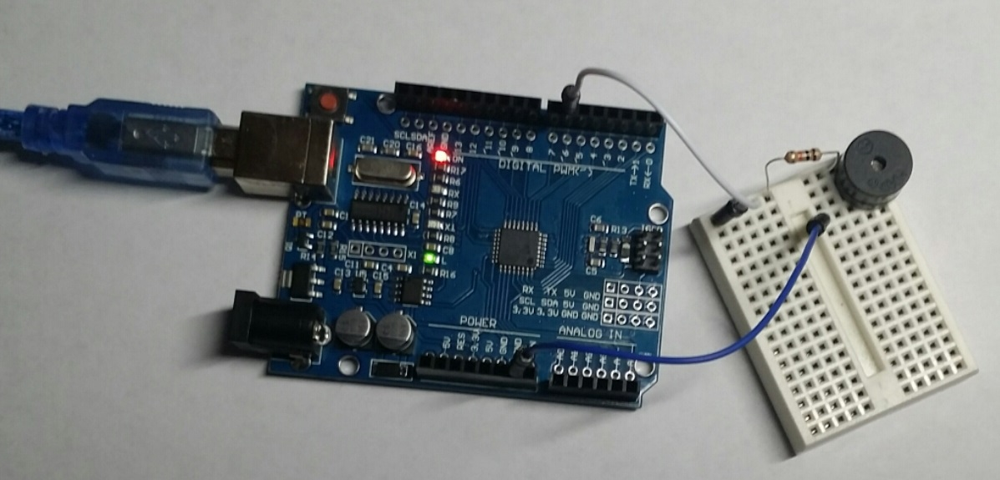

#### Welcome
   * Introduce yourself, your background, and why you want to teach robotics. Do an ice breaker to learn names.
   * Previous knowledge?  

### Step 1: Schoology (15 minutes) 
#### Tell us about your level 1 robot
- What was the name of your Level 1 Robot?
- What was your robot able to do by the end of the level 1 class?
- What did you enjoy most about the level 1 class?
- What was the most challenging part of the class?
- What did you learn about yourself in the level 1 class? 

#### Intro to Robotics Review
- What are the 4 main parts that make up a robot?
- What are the 4 types of engineering that make up robotics? 
- What does it mean to encourage somebody?
- What does it mean to you to be a good community member?

##### EE Review
- You use a _ to slow down the electrical current inside a circuit.
- To make Barnabas-Bot play music, we need to add a _ to our circuit.
- There are 3 components in the picture below.  Can you name them?
{:class="image fit"}

##### CS Review
- We use Ardu_ to program our Barnabas-Bot
- We need to use a _ block to tell our Arduino to wait between commands.
- We use the _ digital _ block to control the light.
- We use the _ block to program Barnabas-Bot to play music
- We use the _ block to move Barnabas-Bot's head and arms.
- Every program needs a _ 

##### ME Review
- What does C.A.D stand for?
- We used the software program called _ to do our CAD.
- See the picture below.  Describe the main parts of a 3-D printer.  What are they called?  What do they do?  Name at least 5 things.
{:class="image fit"}
 
#### Improvement
- What would you do to improve your robot?
- What can you do to improve yourself this semester?



### Step 2: Lesson (45 minutes) 
#### What does it mean to be like Barnabas?
- To be a "Son of Encouragement".  Discuss what encouragement is.
- To be a "Community Builder".  Discuss what it means to be a good community member.

#### General Robotics
- What makes up a robot?
  - 4 main parts of the robot (BODY, HEART, BRAIN, SOUL)
  - 4 types of engineering (MECHANICAL, ELECTRICAL, COMPUTER, SOFTWARE)

#### Mechanical Engineering (THE BODY)
- 3D Printing.  What makes up a 3D printer?
- Mechanical assembly.  Nuts and Bolts.  

#### Electrical Engineering (THE HEART)
- Schematics vs. Circuits
- Breadboarding
- Resistors

#### Computer Engineering (THE BRAIN)
The Barnabas Noggin is the place where all the 

#### Software Engineering (THE SOUL)
You can have the students work in pairs and see if they remember how to launch Arduino and ArduBlock.  Make sure that they go through the process of connecting the Barnabas Noggin, Setting the Port and selecting the right board.

Commands to review: 
- SET DIGITAL PIN, TONE, SERVO, LOOP DO, DELAY

Discuss with the students how the delay block is so important in making code work.  It gives time before each command.  Compare it to when parents give their kids a bunch of commands all at once.  You can't process it!