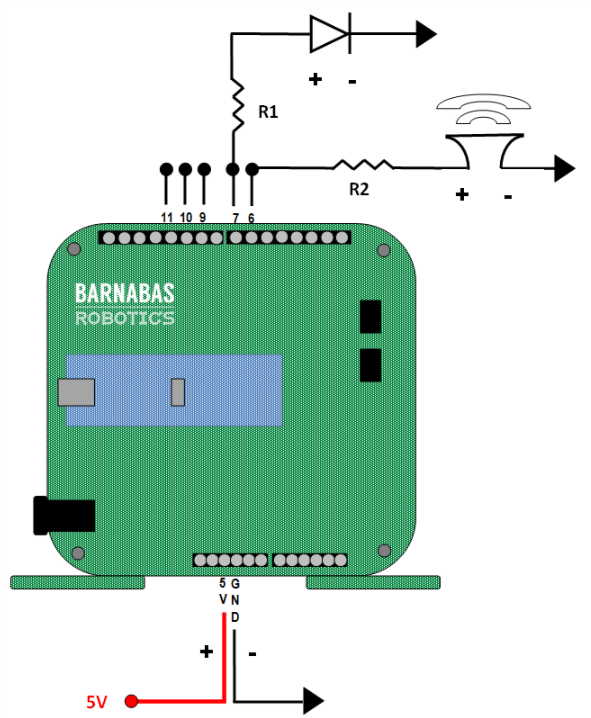

#### Review
   * In this class you will have the class review the process of reading a schematic, building a circuit a programming the circuit to do certain things.  
   * Critical think based on previous question

### Step 1: Wiring your LED and Buzzer (15 minutes) 
Have the students work together to build the two circuits shown in the schematic below. 
{:class="image fit"}

#### Programming Review
We will now have the students review what they did before by going through the same exercises for the light and buzzer from the level 1 class.  You can find the curriculum at the links below.

[LED](lesson/06/index.html#LED)
[Buzzer](lesson/06#Buzzer)

#### Integration Challenge
Now that the students can work with the LED and buzzer, have them integrate both items by achieving the challenge below.

##### CHALLENGE 
Make your circuit do this!
[Light And Buzzer Challenge #1](https://youtu.be/ARKQP-Zd3dY)



### Solution 
{:class="image fit"}
