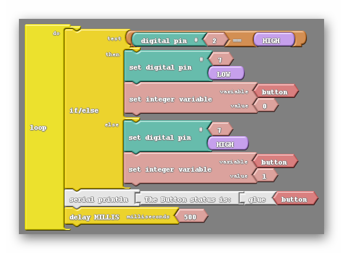

#### Review
   * Previous week  
   * Critical think based on previous question

### Step 1: Getting The Input Value Into A Variable (15 minutes)  
A variable is like a bucket that stores information.  A variable has a name, which is the name of the bucket, and it also has a value, which is the stuff that is inside the bucket.

The program below creates a variable named "button", and it sets it the value "1" if the button is pushed, and "0" if the button is not pushed.

Study the program below to make sure that you understand how it works.

{:class="image "}

#### as Text
```
int button = 0 ;

void setup()
{
  pinMode( 2 , INPUT);
  pinMode( 7 , OUTPUT);
}

void loop()
{
  if (digitalRead(2) == HIGH)
  {
    digitalWrite( 7 , LOW );
    button = 0;
  }
  else
  {
    digitalWrite( 7 , HIGH );
    button = 1;
  }
}
```

### Step 2: Displaying The Variable On The Serial Monitor (45 minutes) 
Now we will display our variable to the screen.  We do this by using the "serial println" block.

{:class="image "}

#### as Text
```
int button = 0 ;

void setup()
{
  pinMode( 2 , INPUT);
  pinMode( 7 , OUTPUT);
  Serial.begin(9600);  
}

void loop()
{
  if (digitalRead(2) == HIGH)
  {
    digitalWrite( 7 , LOW );
    button = 0;
  }
  else
  {
    digitalWrite( 7 , HIGH );
    button = 1;
  }
  Serial.print("The button is: ");
  Serial.print(button);
  Serial.println();
  delay(500);
}
```

Once you download the code, click on "Serial Monitor" on ArduBlock and see the data display!

### Step 3: Customizing Your Message
Now we will modify the message so that it says "the button status is: _____".  Try the program below!

{:class="image "}


[Variables and Serial Monitor](https://youtu.be/u_sgzyL4H04)

#### Challenges
Now that you know how to store input values and display them, try the following challenges!
- Display your robot's name on the screen
- Display on the screen whether the light is on or off.  Display "YES" for on and "NO" for off.  If programmed correctly, the message should change whenever you push the button.
- *Advanced* Create a program so that your Arduino can display the total number of times the button has been pressed.  It should keep counting higher each time you press the button.

