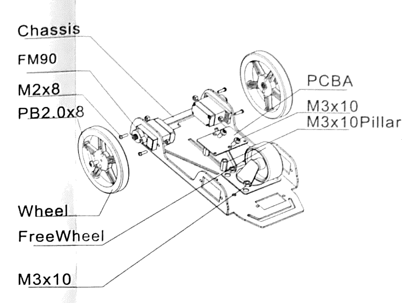
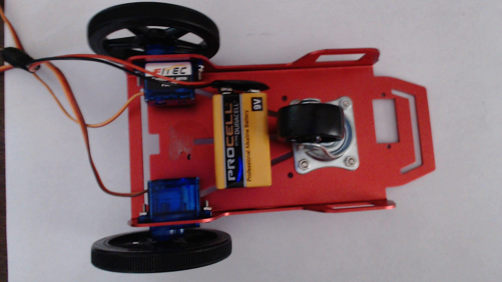

#### Review
   * Previous week  
   * Critical think based on previous question

### Step 1: Assembling the Racer (40 minutes) 
Study the instructions below and put the car together
{:class="image fit"}

{:class="image right"} **Servo Motors**  
Attach the servo motors with the nuts and bolts.  
Be sure to have the bolts insert from the outside.
{:style="overflow: hidden;"}

{:class="image right"} **Castor**  
Attach the castor with the wider and shorter bolts in the front section of the plate.
{:style="overflow: hidden;"}

{:class="image right"} **Wheels**  
Finally, add the wheels to the servo motors with the pin tipped screws.
{:style="overflow: hidden;"}


[Car Chassis Assembly](https://www.youtube.com/watch?v=r8sPTs3qcEo)

### Step 2: Placing the Hardware (15 minutes)
Using your zip ties, tie your hardware down onto the car.  
Use the double stick foam tape on the back of the bread board to stick it onto the car chassis

{:class="image right"} **Top View**  
Attach the Noggin(tm) to the top side of chassis with zip ties. Be sure to leave the barrel jack accessible.
Using the sticky backside of the breadboard, place the breadboard firmly in the front edge of the chassis.
{:style="overflow: hidden;"}

{:class="image right"} **Bottom View**  
Place the 9 Volt battery on the underside of the chassis with double stick foam.
{:style="overflow: hidden;"}


[Mounting Hardware](https://youtu.be/tjeida4DhIM)


