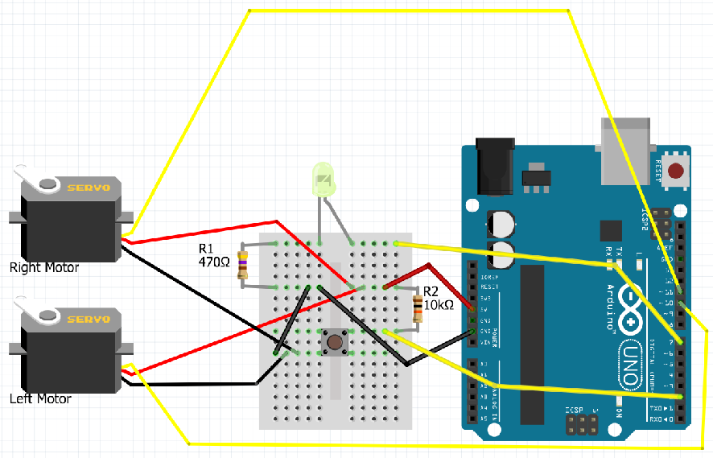
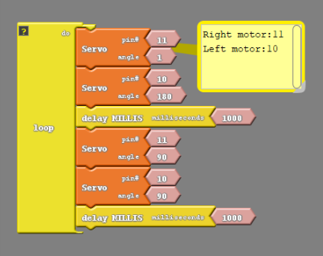
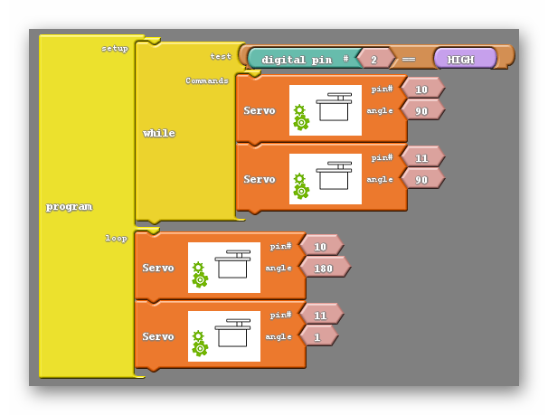

#### Review
   * Previous week  
   * Critical think based on previous question

### Step 0: Wiring Your Continuous Servo Motors (15 minutes) 
{:class="image "}

Keep in mind that the servo motors can also be attached via the servo pin headers on the Barnabas Noggin. Doing so will ensure, however, that that motor function will be greatly diminished while the noggin is only powered by USB.

See video links included on this page.

### Step 1: Geting Your Car Moving (DC Motor Version Only) (15 minutes) 
Lets just try uploading a simple code to the robot to see if we can get it moving. I'm going to show you an incomplete code to begin and I encourage you to allow the students some time to fill in the blanks themselves. This will give them time to re-familiarize themselves with Ardublock and hopefully cement the logic of paired pins and voltage difference into their heads. Here is the code I encourage showing them; 

{:.image .block-based}

This code is missing the HIGH/LOW and constant value blocks (shown below) found in the variables/constants tab;

{:.image .block-based}

Luckily when your students drag the set digital pin blocks into their code it will contain those blocks, however the students will be tasked with giving those blocks the appropriate value to make their robot move forward. This will take some trial and error on the part of the students. If you feel they need it these are the 'big picture' ideas you may want to reiterate;

1. The DC motors are controlled by two pins, so the students should think of the code as two pairs of set digital pin blocks.
2. Those pairs should relate back to the pins the motors are attached to, so if I have attached pins 8 and 11 to the left motor I should pair those together in my code.
3. The DC motors need a voltage difference to operate, so each pair of pins should have a HIGH and LOW set pin.
4. At this point they should upload thier code and see what it does. There's likely going to be alot of robots moving in circles and robots going backwards, as well as some lucky ones that will move forward on the first try. Assuming the pins are paired together correctly (which you can check by look at how they are attached to the motor drive board. The two on the left are paired and the two on the right are paired) the only things that need to be changed are the HIGH/LOW blocks. if the robot is moving in circles switch the places of HIGH and LOW in only one pair of pins. At this point it may move backwards or it may move forwards. If it is moving backwards switch the places of HIGH and LOW in all pins.

If you are still struggling the final code should look like this;

{:.block-based}

While experimenting, your students probably found that some combination of HIGHs and LOWs that allows them to turn one way or the other, or to move backwards instead of forwards. They however probably did not figure out how to make the motors stop, short of disconnecting power. To acheive that, simply add blocks at the end of the code that set the HIGH pins LOW or vice versa. Also remember to add another delay block afterwards so that the stop takes place for a noticable length of time, like this;

{:.block-based}

Notice that the second half of the code only has two set digital pin blocks. More can be used but since we only need to make sure that all pins are either LOW or HIGH simply setting the two that were HIGH to be LOW will do the trick. So this code will now move the robot forward for one second, then hold the robot still for one second. It is recommended that before changing directions, let's say for example if you wanted to move forward then backwards, that you stop briefly before moving again. So your robot would move forward->stop->backwards rather than forwards->backwards.


### Step 2: Motor Control (Servo Motor Version Only) (15 minutes) 
#### Throttle
A throttle is an instrument used in some kinds of motorized vehicles, such as boats, to control speed. These throttles behave in a particular way; the position of the throttle is what dictates the speed and direction of the motor. For example, a throttle may begin in a position which has the motor stopped. When the throttle is pushed forward from that position the motor begins to move forward. The farther forward the throttle is pushed, the faster the motor moves in that direction. If, instead, I pull the throttle backwards, the motor will begin moving backwards, with it picking up speed as I pull the throttle back further and further. 

As it turns out, our continuous servo motors behave very similarly;
{:class="image "}

We can give our motors a command including an angle. Our continuous servo motors understand that angle as moving a throttle back and forth. You can see by the picture above that 90 degrees represents the middle position of the throttle, which would have the motor stopped. An angle larger than 90 will begin moving the motor in one direction, with the speed increasing as the angle approaches 180. Likewise, an angle less than 90 moves the motor in the opposite direction, with the speed increasing as you approach 1.

#### Motion
##### How Continuous Servos Work
Continuous servos are similar to the servos that we used from Barnabas-Bot, except that they move like wheels, rather than just from 0 degrees to 180 degrees.  You will be using the same "Servo" block that you used from your Barnabas-Bot project.  See below for a table that explains what happens when you input different angle values.

|Angle | Direction        | Speed |
|:---  |       :---:      | ---: |
|0     |Clock-wise        | Full |
|90    |None              | Zero |
|180   |Counter Clock-wise| Full |

##### Moving Forward

The code above should move your car forward.  Notice that it seems like the motor should be moving in opposite directions.  Look at how your car is constructed and see if you can see why the car moves forward even though the motors are moving in opposite directions.

{:.image .block-based}

```c
#include <Servo.h>

Servo servo_pin_11;
Servo servo_pin_10;

void setup()
{
  servo_pin_11.attach(11);
  servo_pin_10.attach(10);
}

void loop()
{
  servo_pin_11.write( 1 );
  servo_pin_10.write( 180 );
}
```
{:.text-based}

Well, if we look at the robot from underneath;
{:class="image fit"}
We can see that the two motors are oriented differently, with on pointing out in one direction and the other pointing out in the opposite direction. You can tell this because the sticker is visible on one of them but not on the other. because of this, an angle that would cause a motor to move in one direction will cause the motor on the other side to move in the opposite direction, although at the same speed.

##### Stop Your Motors
The code below will move your car forward for 1 second, stop and then loop forever.

{:.image .block-based}

```c
#include <Servo.h>

Servo servo_pin_11;
Servo servo_pin_10;

void setup()
{
  servo_pin_11.attach(11);
  servo_pin_10.attach(10);
}

void loop()
{
  servo_pin_11.write( 1 );
  servo_pin_10.write( 180 );
  delay( 1000 );
  servo_pin_11.write( 90 );
  servo_pin_10.write( 90 );
  delay( 1000 );
}
```
{:.text-based}

Because there is a button attached to our robot we can create a far more convenient code. We can use the button to trigger movement of the car. In other words have the car be stopped until the button is pressed;

{:.image .block-based}


```c
#include <Servo.h>

Servo servo_pin_11;
Servo servo_pin_10;

void setup()
{
  servo_pin_11.attach(11);
  servo_pin_10.attach(10);
  While (digitalRead(2)==HIGH){
    servo_pin_11.write(90);
    servo_pin_10.write(90);
  }
  delay(500);
}

void loop()
{
  servo_pin_11.write( 1 );
  servo_pin_10.write( 180 );
}
```
{:.text-based}

#### Calibration





