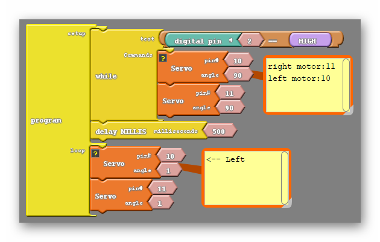

#### Review
Let's recall The code that ultimately got our robot moving forward;

{:.image .block-based}

Getting each motor to move depends on geving it a non 90 degree angle. An angle further from 90 will cause the motor to move faster, and choosing a number on the other side of 90 will cause the motor to change directions. As we learned in the last lesson the two motors are flipped, so that one motor must be given the "opposite" angle to move in the same direction as each other.

```c
#include <Servo.h>

Servo servo_pin_11;
Servo servo_pin_10;

void setup()
{
  servo_pin_11.attach(11);
  servo_pin_10.attach(10);
  
  while (digitalWrite(2)==HIGH)
  {
    servo_pin_11.write( 90 );
    servo_pin_10.write( 90 );
  }
}

void loop()
{
  servo_pin_11.write( 1 );
  servo_pin_10.write( 180 );
}
```
{:.text-based}

### Step 1: Let's Move Backwards!

Drawing from the knowledge we gained to make the racer move forward, we should easily be able to make it move backwards as well. Simply remember that a number on the other side of 90 will make a motor move in the opposite direction:

{:.image .block-based}

```c
#include <Servo.h>

Servo servo_pin_11;
Servo servo_pin_10;

void setup()
{
  servo_pin_11.attach(11);
  servo_pin_10.attach(10);

while (digitalWrite(2)==HIGH){
    servo_pin_11.write( 90 );
    servo_pin_10.write( 90 );
  }
}

void loop()
{
  servo_pin_11.write( 180 );
  servo_pin_10.write( 1 );
}
```
{:.text-based}

That's great! We now know how to put our robots into reverse. 

### Step 2: Can We Make Our Car Turn? (45 minutes) 

```c
#include <Servo.h>

Servo servo_pin_11;
Servo servo_pin_10;

void setup()
{
  servo_pin_11.attach(11);
  servo_pin_10.attach(10);

  while (digitalWrite(2)==HIGH){
    servo_pin_11.write( 90 );
    servo_pin_10.write( 90 );
  }
}

void loop()
{
  servo_pin_11.write( 1 );
  servo_pin_10.write( 180 );
}
```
{:.text-based}

Now let's say that from here we instead want to turn in one direction, how do we do that? Thinking about the direction we want to turn our motors if I wanted to turn left I would have the right motor continue moving forward but change the direction of the left motor. I could do likewise with the right motor if I wanted to turn right instead. The code to do either is below;

{:.image .block-based}

{:.image .block-based}

```c
#include <Servo.h>

Servo servo_pin_11;
Servo servo_pin_10;

void setup()
{
  servo_pin_11.attach(11);
  servo_pin_10.attach(10);

  while (digitalWrite(2)==HIGH){
    servo_pin_11.write( 90 );
    servo_pin_10.write( 90 );
  }
}

void loop()
{
  servo_pin_11.write( 1 ); //both being 1 will turn the robot left
  servo_pin_10.write( 1 ); //both being 180 will turn the robot right
}
```
{:.text-based}

#### Beginning To Turn...
You should find that changing the amount of time one wheel turns either shortens or lengthens the time the robot spends turning and therefore changes how far the robot turns.  Take some time to experiment!
 
Just remember that it will be impossible to see how long a turn lasts for if the turn is the only command being given. Instead, the robot will just turn continuously and appear to spin in place. Instead have a code that will move either forward or backward for some amount of time before turning, like so;

{:.image .block-based}

```c
#include <Servo.h>

Servo servo_pin_11;
Servo servo_pin_10;

void setup()
{
  servo_pin_11.attach(11);
  servo_pin_10.attach(10);

  while (digitalWrite(2)==HIGH){
    servo_pin_11.write( 90 );
    servo_pin_10.write( 90 );
  }
}

void loop()
{
  servo_pin_11.write(1);
  servo_pin_10.write(180);
  delay(500);
  servo_pin_11.write( 1 ); //both being 1 will turn the robot left
  servo_pin_10.write( 1 ); //both being 180 will turn the robot right
  delay(500);
}
```
{:.text-based}

{:.block-based}
### DC
{:.image .block-based}

{:.block-based}
Why did this work again? Well aside from the Uno, Drive board and motors being wired together correctly we also came to the conclusion that each pair of pins had to have a voltage difference between them to engage the motors, as you can see above. Now during last week's activity some of the students likely got their robots to turn or move backwards, but this week we would like to come up with a repeatable procedure that allows us to intentionally do these things.

{:.block-based}
I would like to start with moving backwards. Looking at our two pairs of pins (8+11 and 12+10) you can see the specific pin of each pair that is LOW and the one that is HIGH. It turns out that this matters. The order in Which HIGH and LOW are assigned change the direction that the motors move. Knowing that, moving backwards is as easy as switching the places of HIGH and LOW for both pairs of pins;

{:.image .block-based}

{:.block-based}
This works simply because the voltage difference between our pins, and therefore across the motor, is in the opposite direction. That is what turns the motors in the opposite direction.

{:.block-based}
That's great! We now know how to put our robots into reverse. Lets jump back to our original forward code for a second;

{:.image .block-based}

{:.block-based}
Now let's say that from here we instead want to turn in one direction, how do we do that? Thinking about the direction we want to turn our motors if I wanted to turn left I would have the right motor continue moving forward but change the direction of the left motor. I could do likewise with the right motor if I wanted to turn right instead. To do this we will change HIGH and LOW between one pair of pins.

{:.block-based}
The question for your students to answer is which pair of pins corresponds to the left motor and which pair of pins corresponds to the right motor. Many may be able to take an educated guess based on how the motors are wired, but challenge them to test that intuition by experimenting. Have them play with the pin settings in Ardublock until the class comes to a consensus on which pins are the right motor pins and which are the left.

{:.block-based}
After the class has figured that out, ask them to change the number of milliseconds in the delay block and see what effect that has on their robots. They should find that changing that number shortens or lengthens the time the robot spends turning and therefore changes how far the robot turns.  This is pretty important as, at some point, we will want to precisely turn our robots say... 90 degrees. Challenge your students to find that delay that makes a perfect 90 degree turn.

- **Note**: Remember that you want to make a portion of your code at the end of any movement that brings your robot to a stop before having it move again. Without this it will be difficult to determine how far the robot is turning in a single command, as it will appear to turn continuously.

After doing that, if there is still time, ask your students to try implimenting a code that moves the robot in all directions. For example a code that moves the robot forward, then turn it left, then move backwards, then turn it right. Keep in mind the note above when attempting this. 
