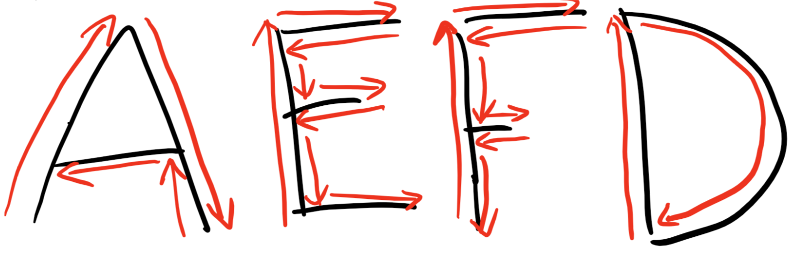

#### Review
   * Previous week  
   * Critical think based on previous question

### Moving In Shapes
Now that we can go to a goal and come back, let's take it up a notch.  See if your car can travel along the ground to create the following letters below.  
Draw the letters A, E, F and D on a piece of paper and see if your car can drive along it.  
See the red arrows for the path that your car should travel.

{:class="image fit"}

#### Some things to keep in mind during this lesson:
- The delay in your forward subroutine probably will not move the robot forward the exact distance needed. You will either need to adjust that delay or use the forward subroutine multiple times.
- How would you make your car move in an arc to draw the "D"? Hint: It has something to do with adjusting the motor speeds.
