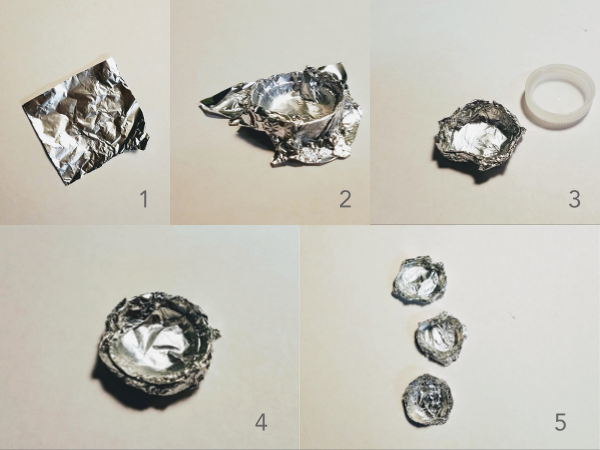
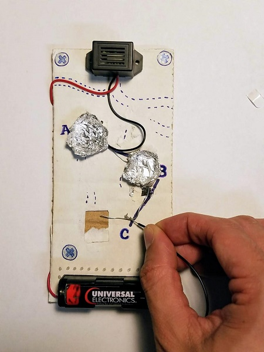
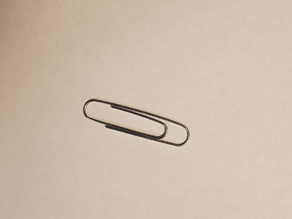
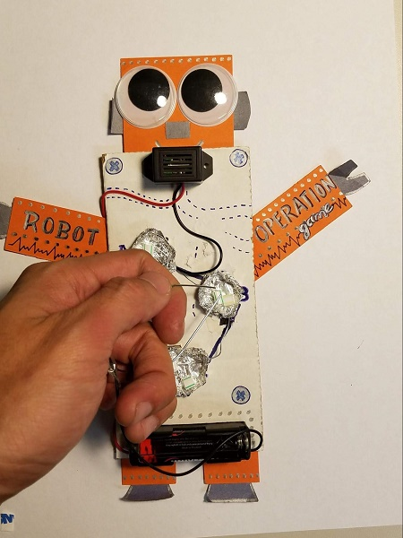

###  Project Steps
#### Introductions (5 min)
Today we will be creating a game while experimenting with electricity. We will take time to plan (design) our creation and actually build it based on those plans. The things we build might not work the first time, but this is OK, because things not working is a part of tinkering/inventing. It will be important for us to keep trying as we experiment!  

#### Circuits and Schematics (5 min)
In today's project, we will learn how to draw a schematic on paper and then follow it to build a working circuit.  

1. A circuit is a path of electricity - like a street.
2. A schematic is the plan of a circuit - like a city map.

#### Creating A Buzzer Circuit (10min)
Draw the following schematic. The battery is what we like to call the heart of the circuit. It is what gives power to the circuit. Instead of pumping blood like a heart, the battery pumps electricity. The buzzer is like a speaker - where sound comes out. Notice that both the battery and buzzer have pluses and minuses on them. This will be important later on. Don't mix them up!

{:class="image "}

Examine the buzzer and notice that there are both red and black wires. 
The red wire is the positive wire, and the black wire is the negative wire.

{:class="image "}

Look at the battery and see if you can see where it says 1.5 Volts. This is the amount of power that is inside the battery. The more voltage, the more powerful your circuit will be! Also find where there is a + and - on your battery. Turn on the buzzer by connecting: 1) the positive end (red wire) of the buzzer to the positive end (+) of the AA battery; and 2) the negative end (black wire) of the buzzer to the negative end (-) of the AA battery. You should hear a buzzing sound coming from the buzzer. (This will verify that AA battery and the buzzer are working properly.)  

Place the battery into the battery holder. Tip: + connects to the red wire, and - connects to the black wire.

Now let's look at the schematic that we drew. If we follow the map, it will help us build the path. Connect the red wire of the buzzer with the red wire of the battery holder, while simultaneously holding the black wire of the buzzer with the black wire of the batter holder. Again, you should hear a buzzing sound coming from the buzzer. (This will verify that battery holder is working properly.)

{:class="image "}

  

Once it turns on, you have successfully created what we call a closed-circuit. It is called a closed-circuit because there is a closed-loop. Imagine you are a piece of electricity traveling from the + of the battery. You can follow a path all the way through the buzzer and back into the - of the battery. When you break the connections, the buzzer turns off, and it is called an open-circuit. In this case, the electricity can't make it all around the circuit. Take a moment to draw an open-circuit schematic in addition to the closed-circuit schematic.

{:class="image "}

Now that we know how open-circuits and closed-circuits work, let's take our battery out of the battery holder and put it on the side. This will keep things nice an quiet as we finish building our game.

#### Adding Our Buzzer and Battery (15 min)

1. Draw the placement of the buzzer and battery holder. After you do that, use double stick foam to attach the buzzer and battery holder to your piece of cardboard.

{:class="image"}

2. Draw the connection between the two red wires. Connect the red wires together on the back of the cardboard. Use tape to reinforce the connection. Put the battery in and make sure that your circuit is working by connecting the black wires with your finger. Notice that this will create a closed-circuit.  

{:class="image "}

Draw in a metal pincher connected to the - of the battery holder. We will add the pincher later, but we first want to put it into our design.

{:class="image "}

Add three circles to your schematic and label them A, B and C. This is where we will put our aluminum bowls. Draw lines that connect A, B and C. Using a marker, draw these three circles on your cardboard. Also draw lines that the circles. These lines represent the wires that will connect A, B and C together.

  

{:class="image "}

#### Creating Our Metal Bowls (5 min)
Use the bottle cap to form bowls. Once you form the aluminum bowl, take the
bottle cap out from the bottom and pinch the sides of the aluminum foil so that the bowl can stand on its own.
You will need to make three of these in total.   

{:class="image "}

#### Placing & Connecting Our Bowls (15 min)
Lay down a piece of sticky foam near near the A. Place the - wire of the buzzer on the stick foam. Also take a metal wire and put one end on the same sticky foam. Now simply press the bowl onto the sticky foam firmly. Put the battery in the battery holder and touch the of the battery holder to the metal wire to see if electricity flows through the entire circuit and buzzes.  
If not, it's time to figure out where your circuit is open! 

{:class="image "}

{:class="image "}
{:class="image "}

{:class="image "}

  

Lay down a piece of sticky foam near near the B. Connect the other end of the metal wire to the foam and also a new metal wire. Now simply press the bowl onto the sticky foam firmly. Put the battery in the battery holder and touch the - of the battery holder to the new metal wire to see if electricity flows through the entire circuit and buzzes. If not, it's time to figure out where your circuit is open! At this time, touching both bowl A and bowl B should turn the buzzer on.

{:class="image "}

{:class="image "}

{:class="image "}

Lay down a piece of sticky foam near near the C. Place the - wire of the buzzer on the stick foam. Also take a metal wire and put one end on the same sticky foam. Now simply press the bowl C onto the sticky foam firmly. Put the battery in the battery holder and touch the - of the battery holder to the bowl to see if electricity flows through the entire circuit and buzzes. If not, it's time to figure out where your circuit is open! At this point, touching bowls A, B and C should create a buzz sound.

{:class="image "}

{:class="image "}

#### Creating The Tweezers (10 min)
Unfold the paper clip so that it looks like a U.

{:class="image "}

{:class="image "}

Wrap the metal part of the black wire of the battery holder to the pincher. It helps to create a little hook with the wire (see picture). Once the pincher is hanging on, twist the wires (see picture). Now tape it together to secure the connection.  Remember that metal needs to touch metal!

{:class="image "}

{:class="image "}

{:class="image "}

#### Decorate your Operation Game! (15 min)
{:class="image "}

{:class="image "}

- Use construction paper to create a head and arms. Tape them on (see picture)!
- Add some googly eyes.
- Have fun with markers!

#### Operation Time! (10 min)
- Use cut up straws to create foreign objects for the stomach
- Find a partner and try to take out the objects using your metal pincher. See who is the best operator!

{:class="image "}

#### Additional Resources
[External Doc](https://docs.google.com/document/d/1dB4QCPW3kvROx7-HR0IJLWUO6zU1Ya95UQMl5_9bkLs/view)